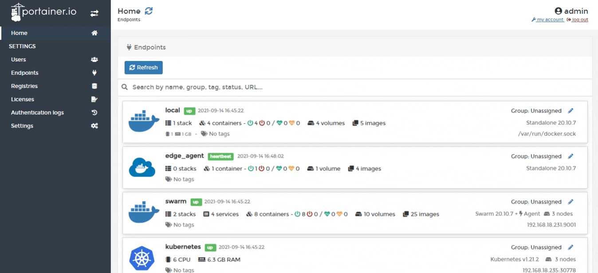

# Add an ACI endpoint

Before connecting to your Azure subscription, you need to create an Azure AD application. For more information please refer to [Microsoft's own documentation](https://docs.microsoft.com/en-us/azure/active-directory/develop/howto-create-service-principal-portal).


The following ACI features are not currently supported:

* ACI persistent storage.
* Private networks.


From the menu select **Endpoints** then click **Add endpoint** and select **Azure** as the environment type.

Enter the details, using the table below as a guide.

| Field/Option | Overview |
| :--- | :--- |
| Name | Give the endpoint a descriptive name. |
| Application ID | Take this value from the application you created in Azure. |
| Tenant ID | Use the same tenant ID as appears on the Azure subscription page. |
| Authentication ID | Take this value from the application creation process in Azure. |

In the **Metadata** section, as an optional step you can categorize the endpoint by adding it to a [group](../groups.md) or  [tagging](../tags.md) it for better searchability.

When you're ready, click **Add endpoint**.

