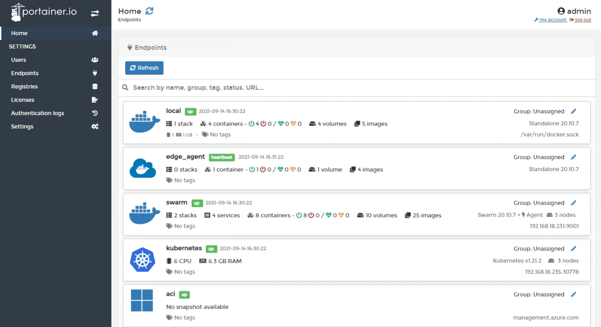

# Add a Docker Swarm endpoint

## Deploying the agent

From the menu select **Endpoints** then click **Add endpoint**. Ensure **Agent** is selected in **Environment type**.



In the **Information** section select the correct operating system for the new endpoint then select the **Docker Swarm** tab. Copy the command, then run it on the manager node of your Docker Swarm cluster.


You must run the command on the Docker Swarm cluster before entering the environment details.



The deployment command will return something similar to this:

```text
Creating network portainer-agent_portainer_agent
Creating service portainer-agent_agent
```

To validate the agent is running,  run the following command:

```text
 docker service ls
```

The result of which should look something like this:

```text
ID                  NAME                    MODE                REPLICAS            IMAGE                    PORTS
tshb6ee2710s        portainer-agent_agent   global              1/1                 portainer/agent:latest
```

## Finishing the configuration

Once the agent is running on the Docker Swarm cluster, enter the environment details, using the table below as a guide:

| Field | Overview |
| :--- | :--- |
| Name | Give the endpoint a descriptive name. This is a required field. |
| Endpoint URL | Enter the IP or DNS name at which the Portainer Server instance can reach the endpoint along with the port \(`9001`\) if required. This is a required field. |
| Public IP | URL or IP address where exposed containers will be reachable. This is an optional field and will default to the endpoint URL. You can change it later if you need to. |


In the **Metadata** section, as an optional step you can categorize the endpoint by adding it to a [group](../groups.md) or  [tagging](../tags.md) it for better searchability.


When you're ready click **Add endpoint**.  


