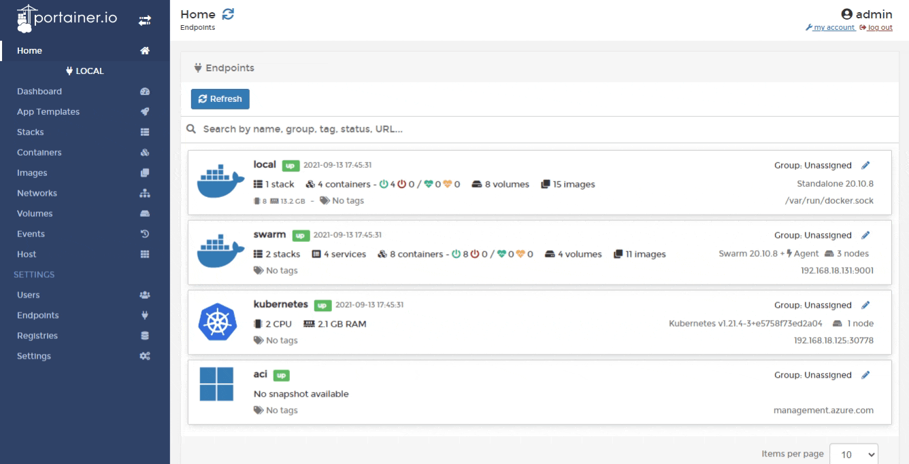
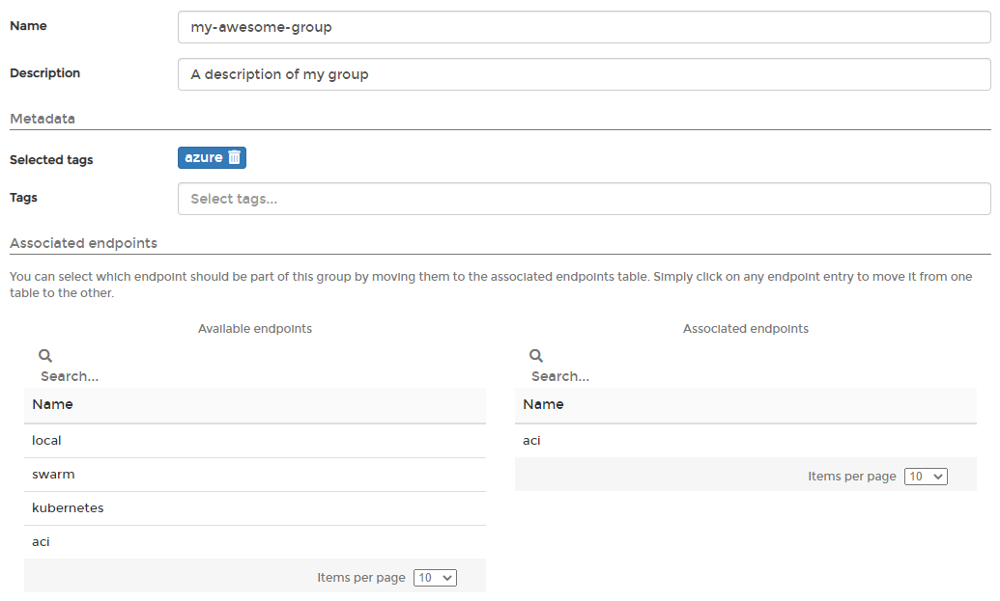

# Groups

Groups organize your endpoints in Portainer. As an example, you can create groups for development, staging and production to differentiate between endpoint roles. You can also use groups to define which endpoints are available to which users.


Portainer Community Edition supports basic user and group assignments. For more complex user roles within groups, use Portainer Business Edition.


## Adding a group

From the menu select **Endpoints**, select **Groups**, then click **Add group**. 

Define the properties of the group, using the table below as a guide.

| Field/Option | Overview |
| :--- | :--- |
| Name | Give the group a descriptive name. |
| Description | Optionally describe the group in more detail. |
| Tags | Apply any tags to the group. |
| Associated endpoints | Select the endpoints to be categorized in the group. |

When you're finished, click **Create the group**.

## Removing a group

When you no longer need a group, you can remove it by ticking the box next to the group then clicking **Remove**.


Removing a group will not delete endpoints and users in that group. However, it may change the endpoints accessible to users who have their access assigned via a group.


