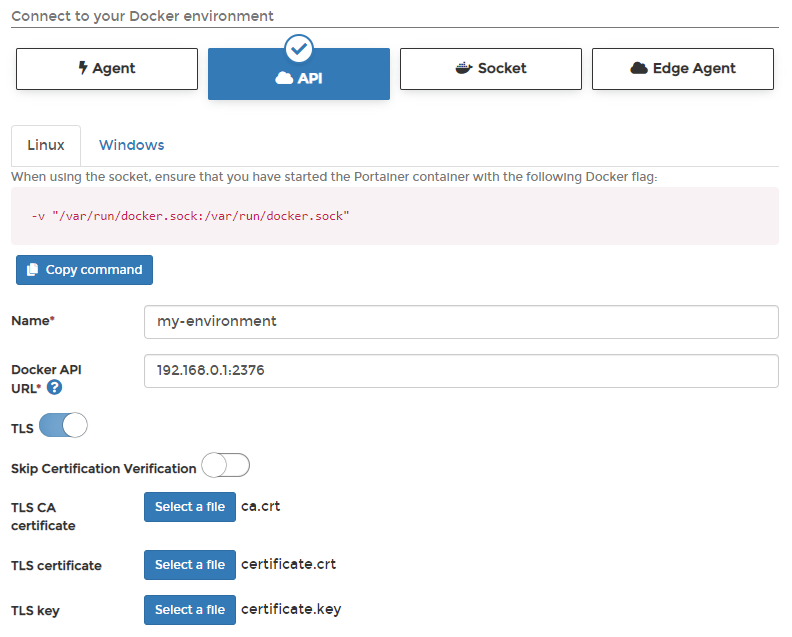
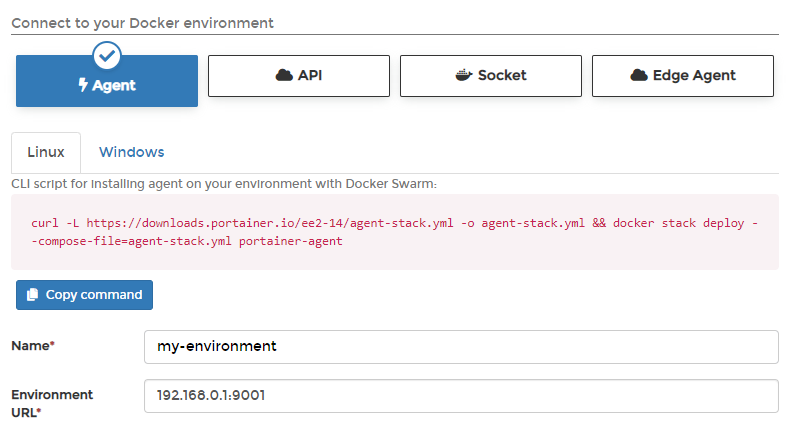

# Add a Docker Standalone environment

When connecting a Docker Standalone host to Portainer, there are two methods you can use. You can either connect directly to the Docker API via TCP, or you can install the Portainer Agent on the Docker Standalone host and connect via the agent.

## Connecting via the Docker API

Before you begin, you will need to ensure that your Docker instance is configured to admit remote connections. To learn how to do this, refer to Docker's own documentation. Once Docker is configured, you will be able to connect either with or without TLS.

From the menu select **Environments** then click **Add environment**.

Next, select **Docker** as the environment type then click **Start Wizard**. Select the **API** option and your platform, then enter the environment details using the table below as a guide:

| Field/Option                    | Overview                                                                                                                                                                                           |
| ------------------------------- | -------------------------------------------------------------------------------------------------------------------------------------------------------------------------------------------------- |
| Name                            | Give the environment a descriptive name.                                                                                                                                                           |
| Docker API URL                  | Enter the DNS name or IP address to connect to the Docker host along with the port. When connecting without TLS, the default port is `2375`. When connecting with TLS, the default port is `2376`. |
| TLS                             | Toggle this option on if you wish to use TLS. Toggle it off if you don't want to use TLS.                                                                                                          |
| Skip Certification Verification | Toggle this option on to skip the verification of the TLS certificate used by the Docker API. If this option is off, the below fields will not appear.                                             |
| TLS CA certificate              | Select your CA certificate.                                                                                                                                                                        |
| TLS certificate                 | Select your certificate.                                                                                                                                                                           |
| TLS key                         | Select the key that matches the certificate.                                                                                                                                                       |


Portainer expects TLS certificates and keys to be in PEM format.


As an optional step you can expand the **More settings** section and categorize the environment by adding it to a [group](../groups.md) or [tagging](../tags.md) it for better searchability.

When you're ready, click **Connect**. If you have other environments to configure click **Next** to proceed, otherwise click **Close** to return to the list of environments.

## Connecting via the Portainer Agent

First, install the Portainer Agent on your Docker Standalone instance using our [platform-specific instructions](broken-reference). When this is done, you will be able to add the environment to Portainer.

From the menu select **Environments** then click **Add environment**.

Next, select **Docker** as the environment type then click **Start Wizard**. Select the **Agent** option, then enter the environment details using the table below as a guide:

| Field/Option    | Overview                                                                                                             |
| --------------- | -------------------------------------------------------------------------------------------------------------------- |
| Name            | Give the environment a descriptive name.                                                                             |
| Environment URL | Enter the DNS name or IP address to connect to the Portainer Agent along with the port (the default port is `9001`). |


You can ignore the command presented (and the mention of Docker Swarm) as you have already deployed the agent, therefore we can use this same process for a Docker Standalone installation.


As an optional step you can expand the **More settings** section and categorize the environment by adding it to a [group](../groups.md) or [tagging](../tags.md) it for better searchability.

When you're ready, click **Connect**. If you have other environments to configure click **Next** to proceed, otherwise click **Close** to return to the list of environments.
