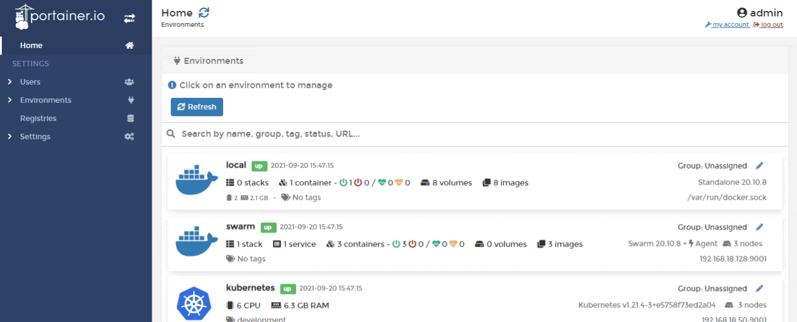

# Add an Edge environment

The Edge Agent was created as a way to manage an Edge Compute environment where devices typically lack the networking capability to run the traditional Portainer Agent. For more information about the Edge Agent and how it works, take a look at our [advanced documentation](../../../advanced/edge-agent.md).

## Preparation

### Exposing port 8000


Exposing the tunnel port only applies when the Portainer Server is running in a Docker or Docker Swarm environment. Kubernetes users do not need to expose this port.


The Edge Agent communicates with the Portainer Server instance over port `8000`. Through this port, the Edge Agent can poll the Portainer instance, connect to Portainer, see when it is required, then initiate a tunnel or receive configuration updates. Without port `8000` exposed on the Portainer Server instance, you cannot access the Edge endpoint. If you already deployed Portainer without this port open, you will need to redeploy with port `8000` exposed alongside the port used to access Portainer. Using the CLI flag `--tunnel-port` you can set a different port if `8000` is already in use. For more information see [CLI options](../../../advanced/cli.md).

### Deployment methods available

| Method                           | Overview                                                                                                                                                                                                                                                     |
| -------------------------------- | ------------------------------------------------------------------------------------------------------------------------------------------------------------------------------------------------------------------------------------------------------------ |
| Portainer with TLS               | If your Portainer instance is deployed with TLS, the agent will use HTTPS for the connection it makes back to Portainer. This is the recommended approach.                                                                                                   |
| Portainer with Self-Signed Certs | If you are using a self-signed Portainer instance, the Edge Agent must be deployed with the flag `-e EDGE_INSECURE_POLL=1`. If you do not deploy Portainer with this flag, the agent cannot communicate with Portainer. This option is less secure than TLS. |
| Portainer Fallback to HTTP       | If Portainer is not configured with either of the above options, it will use HTTP for agent polling as a fallback. We do not recommend this option because it is not secure.                                                                                 |

## Adding an Edge environment to Portainer

From the menu select **Environments** then click **Add environment** and select **Edge Agent** as the environment type.

Enter the environment details, using the table below as a guide.

| Field/Option         | Overview                                                                             |
| -------------------- | ------------------------------------------------------------------------------------ |
| Name                 | Give the environment a descriptive name.                                             |
| Portainer server URL | The public IP or DNS of your Portainer Server instance and the port.                 |
| Poll frequency       | How often the Edge Agent polls the Portainer Server instance. Defaults to 5 seconds. |

When you have finished, click **Add environment**.

You will be taken to the **Environment details** page for the new environment where you can select the type of environment to deploy. You will be given a command to run on the environment which will initiate the connection with the Portainer Server instance.


A join token is also displayed if you are pre-staging your Edge agents.


Once you have run the command, go to the **Configuration** section and enter the public IP for the environment you just added.

In the **Metadata** section, as an optional step you can categorize the environment by adding it to a [group](../groups.md) or [tagging](../tags.md) it for better searchability.

When you're ready, click **Update environment** to complete the configuration.


For security, if an agent does _not_ have a custom `AGENT_SECRET` defined and has been running for longer than 72 hours _without_ being associated with a Portainer Server installation, the agent will stop accepting connections until it is restarted.

