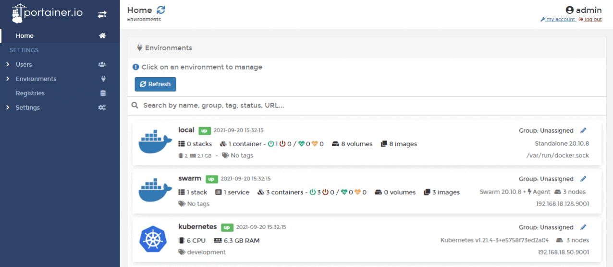

# Add a Docker Swarm environment

## Deploying the agent

From the menu select **Environments** then click **Add environment**. Ensure **Agent** is selected in **Environment type**.



In the **Information** section select the correct operating system for the new environment then select the **Docker Swarm** tab. Copy the command, then run it on the manager node of your Docker Swarm cluster.


You must run the command on the Docker Swarm cluster before entering the environment details.



The deployment command will return something similar to this:

```
Creating network portainer-agent_portainer_agent
Creating service portainer-agent_agent
```

To validate the agent is running, run the following command:

```
 docker service ls
```

The result of which should look something like this:

```
ID                  NAME                    MODE                REPLICAS            IMAGE                    PORTS
tshb6ee2710s        portainer-agent_agent   global              1/1                 portainer/agent:2.11.1
```

## Finishing the configuration

Once the agent is running on the Docker Swarm cluster, enter the environment details, using the table below as a guide.


Only do this **once** for your environment, regardless of how many nodes are in the cluster. You do **not** need to add each node as an individual environment in Portainer. Adding just one node (we recommend the manager node) will allow Portainer to manage the entire cluster.


| Field        | Overview                                                                                                                                                                 |
| ------------ | ------------------------------------------------------------------------------------------------------------------------------------------------------------------------ |
| Name         | Give the environment a descriptive name. This is a required field.                                                                                                       |
| Endpoint URL | Enter the IP or DNS name at which the Portainer Server instance can reach the environment along with the port (`9001`) if required. This is a required field.            |
| Public IP    | URL or IP address where exposed containers will be reachable. This is an optional field and will default to the environment URL. You can change it later if you need to. |


In the **Metadata** section, as an optional step you can categorize the environment by adding it to a [group](../groups.md) or [tagging](../tags.md) it for better searchability.


When you're ready click **Add environment**.


For security, if an agent does _not_ have a custom `AGENT_SECRET` defined and has been running for longer than 72 hours _without_ being associated with a Portainer Server installation, the agent will stop accepting connections until it is restarted.

