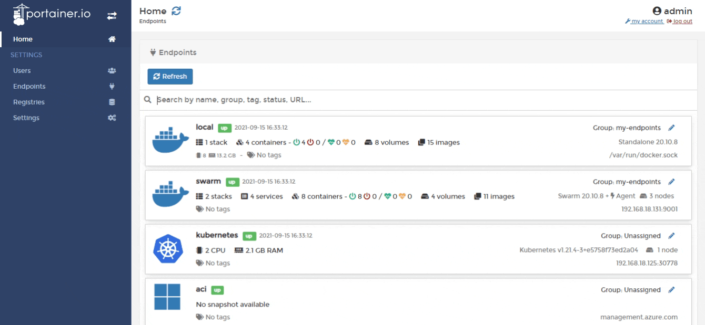
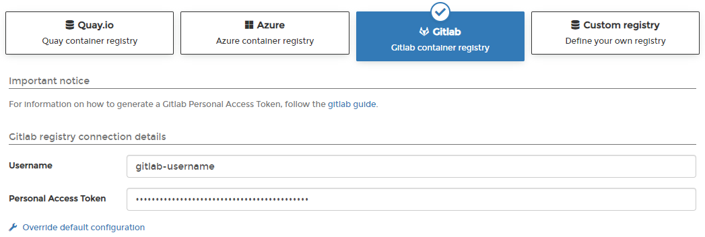

# Add a Gitlab registry

From the menu select **Registries** then click **Add registry** and select **Gitlab** as the registry provider.

Complete the form, using the table below as a guide.

| Field/Option                   | Overview                                                                                   |
| ------------------------------ | ------------------------------------------------------------------------------------------ |
| Username                       | Enter the username you use to log into your Gitlab registry.                               |
| Personal Access Token          | Enter the personal access token (scope: `read_api`) that corresponds to the username above. |
| Override default configuration | If you need to make changes to the Portainer defaults for Gitlab, you can do so here.      |


For more information about creating a personal access token, see [Gitlab's own documentation](https://docs.gitlab.com/ee/user/profile/personal\_access\_tokens.html).


When the form is complete, click **Add registry**.


Simply adding a registry will not make that registry available to non-administrator users. Once you have added the registry to Portainer, you will need to add access to the registry within [Host](../../../user/docker/host/registries.md) / [Swarm](../../../user/docker/swarm/registries.md) / [Cluster](../../../user/kubernetes/cluster/registries.md) for each environment that needs access.

