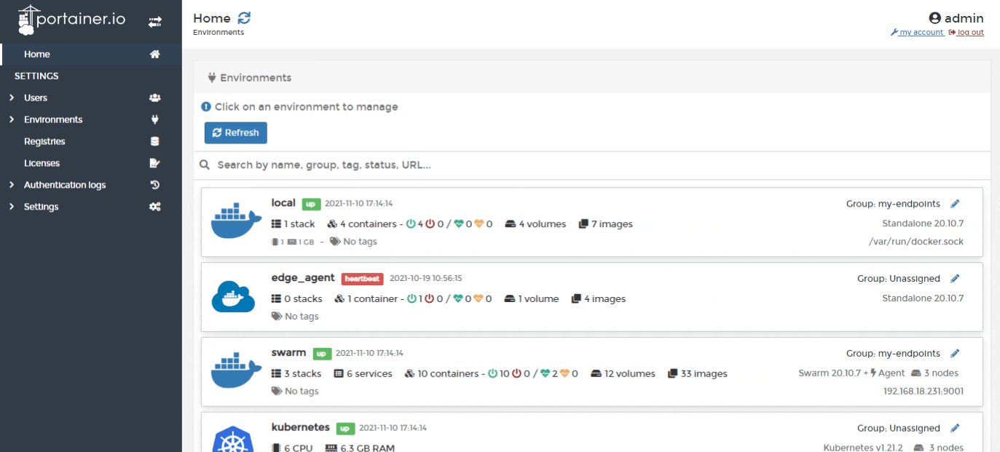
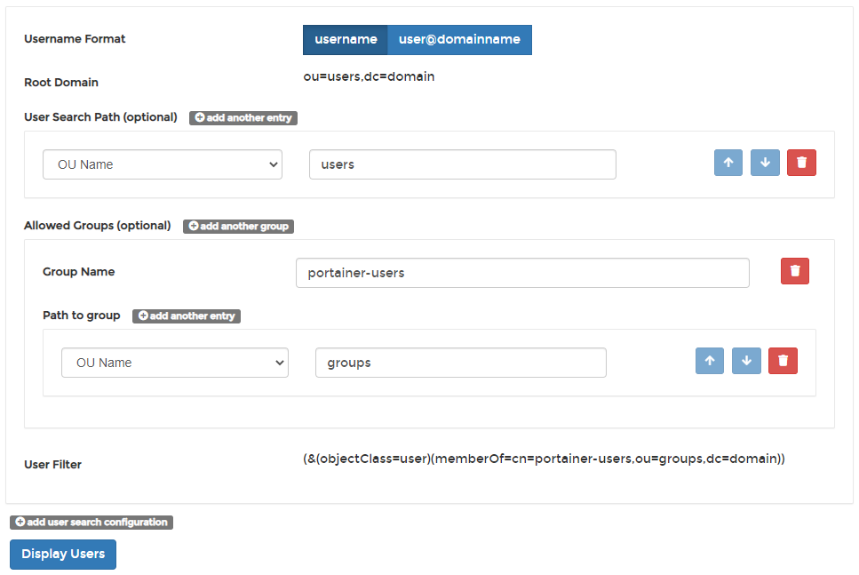
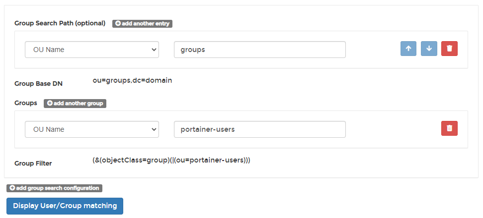

# Authenticate via Active Directory

Portainer Business Edition lets you connect to an existing Microsoft Active Directory service to manage your authentication settings in Portainer.

To set up Active Directory authentication, from the menu select **Settings** then select **Authentication**. Under the **Authentication method** section select **Microsoft Active Directory**.

A guide to all of the Active Directory configuration settings follows.

## Automatic user provisioning

Enabling this setting automatically creates users within Portainer once they are successfully authenticated by Active Directory (AD). If you do not enable this, you must [manually create users](ldap.md#manually-creating-ldap-users) with the same username as the corresponding AD user.

## AD configuration

Configure your Active Directory details using the table below as a guide.

| Field/Option             | Overview                                                                                                                                                                                                                 |
| ------------------------ | ------------------------------------------------------------------------------------------------------------------------------------------------------------------------------------------------------------------------ |
| AD Controller            | Enter the FQDN or IP address of your domain controller. If you need to add more than one server, click **Add additional server**.                                                                                        |
| Service Account          | Enter the account name that is used to connect to Active Directory and search users.                                                                                                                                     |
| Service Account Password | Enter the password for the above service account.                                                                                                                                                                        |
| Connectivity check       | Perform a check to ensure there is connectivity and SSL handshaking between Portainer and your Active Directory server (if **Use StartTLS** or **Use TLS** are selected under the **AD Connectivity Security** section). |

## AD Connectivity Security

Configure the security settings using the table below as a guide.

| Field/Option                            | Overview                                                                                                                                                  |
| --------------------------------------- | --------------------------------------------------------------------------------------------------------------------------------------------------------- |
| Use StartTLS                            | Enable this option if want to use StartTLS to secure the connection to the server. Enabling this will hide and ignore the **Use TLS** option.             |
| Use TLS                                 | Enable this option if you need to specify TLS certificates to connect to the LDAP server. Enabling this will hide and ignore the **Use StartTLS** option. |
| Skip verification of server certificate | Toggle this option on if you want to skip the verification of the server TLS certificate. Not recommended on unsecured networks.                          |
| TLS CA certificate                      | Lets you upload the CA certificate for your TLS certificate.                                                                                              |

## User search configurations

Configure the user search configurations using the table below as a guide. Click **add user search configuration** to set up multiple configurations.

| Field/Option                | Overview                                                                                                                          |
| --------------------------- | --------------------------------------------------------------------------------------------------------------------------------- |
| Username Format             | Select the username format you want to use when logging into Portainer. Options are `username` and `username@domainname`.         |
| Root Domain                 | This will be filled with the domain of the domain controller.                                                                     |
| User Search Path (optional) | Click **add another entry** to define specific OUs or folders to search for users.                                                |
| Allowed Groups (optional)   | Click **add another group** to define specific groups to be allowed access to Portainer.                                          |
| User Filter                 | This will be filled based on the options you selected previously.                                                                 |
| Display Users               | Click this to use the settings provided to query the Active Directory server for a list of users matching the specified criteria. |

## Group search configurations

Configure the group search configurations using the table below as a guide. Click **add group search configuration** to set up multiple configurations.

| Field/Option                 | Overview                                                                                                                                                                     |
| ---------------------------- | ---------------------------------------------------------------------------------------------------------------------------------------------------------------------------- |
| Group Search Path (optional) | Click **add another entry** to define specific OUs or folders to search for groups.                                                                                          |
| Group Base DN                | Automatically updated based on previous selections.                                                                                                                          |
| Groups                       | Click **add another group** to define specific groups by OU or folder name.                                                                                                  |
| Group Filter                 | This will be filled based on options previously selected.                                                                                                                    |
| Display User/Group matching  | Click this to use the settings provided in Portainer to query the Active Directory server for a list of users matching the criteria specified, and how they match to groups. |

## Auto-populate team admins

If desired, Portainer can configure specified AD groups of users to become Portainer administrators automatically.&#x20;

To configure this, first click **add group search configuration** and define the **Group Base DN**, **Groups** and **Group Filter** as required. Once done, click the **Fetch Admin Group(s)** button to retrieve the list of groups matching your search configuration.

When you're happy with the group selection, enable this feature by toggling **Assign admin rights to group(s)** on.

## Test login

To test your settings are correct and that the right users and groups are configured for access, scroll down to **Test login**, enter a valid user and password then click **Test**. If everything is working as expected, a green tick will appear next to the button.

