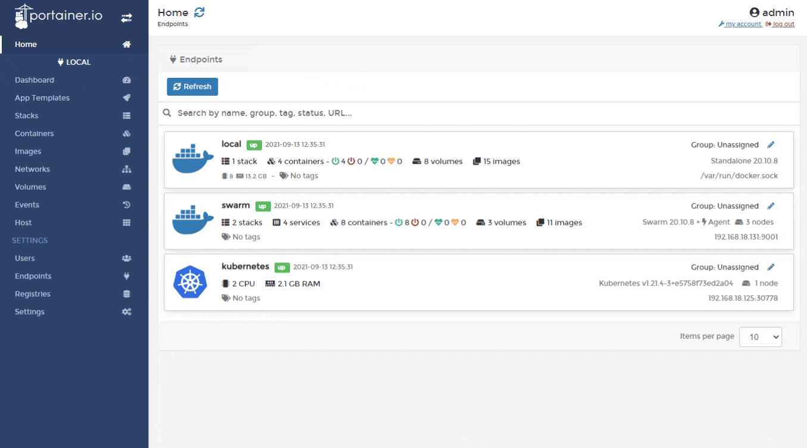
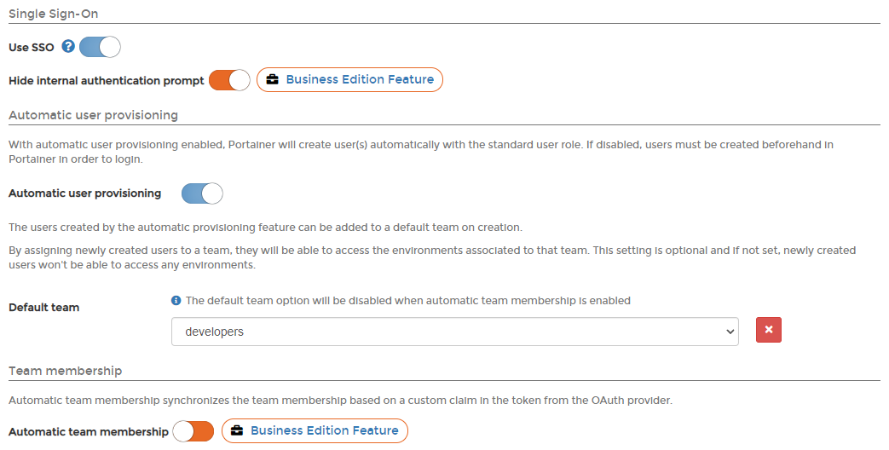
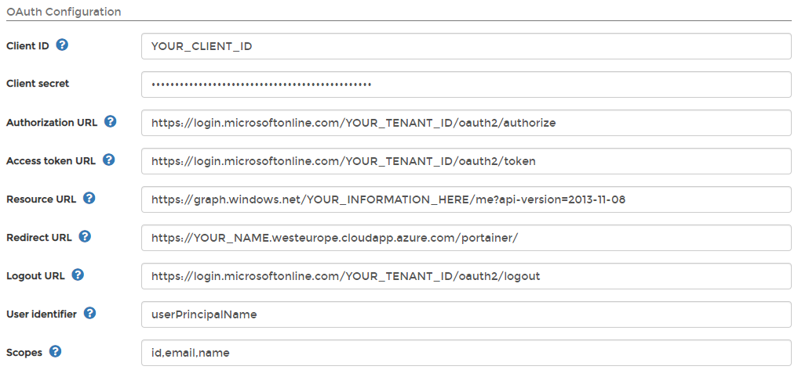
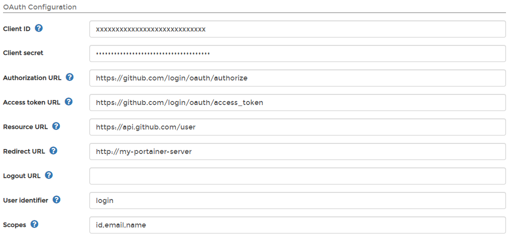
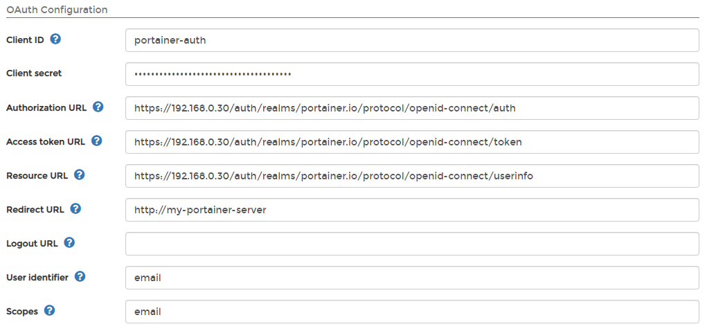

# Authenticate via OAuth

## Configuring OAuth authentication in Portainer

From the menu select **Settings** then select **Authentication**. Under the **Authentication method** section click **OAuth**.

In the next screen, enter the credentials provided by your OAuth provider, using the table below as a guide.

| Field/Option                        | Overview                                                                                                                                                                                                                                                                      |
| ----------------------------------- | ----------------------------------------------------------------------------------------------------------------------------------------------------------------------------------------------------------------------------------------------------------------------------- |
| Use SSO                             | Enable SSO so that the OAuth provider won't be forced to ask for credentials when users are in a current logged-in session.                                                                                                                                                   |
| Hide internal authentication prompt | Hide the ability to log in through internal authentication. This feature is only available in [Portainer Business Edition](https://www.portainer.io/business-upsell?from=hide-internal-auth).                                                                                 |
| Automatic user provisioning         | If toggled on, users who exist at the OAuth provider's end will automatically be created in Portainer (you can define a default team to put those users in while this option is on). If toggled off, you'll need to [create users](../../users/add.md) in Portainer manually. |
| Automatic team membership           | This synchronizes the team members based on a custom claim in the token from the OAuth provider. This feature is only available in [Portainer Business Edition](https://www.portainer.io/business-upsell?from=hide-internal-auth).                                            |

Select your OAuth provider from the options.


Pre-filled templates for Microsoft, Google and Github are available in [Portainer Business Edition](https://www.portainer.io/business-upsell?from=hide-internal-auth).


Complete the **OAuth Configuration** section based on the table below.

| Field/Option      | Overview                                                                                                                                                             |
| ----------------- | -------------------------------------------------------------------------------------------------------------------------------------------------------------------- |
| Client ID         | Enter the public identifier of the OAuth application.                                                                                                                |
| Client secret     | Enter the token access to the OAuth application.                                                                                                                     |
| Authorization URL | Enter the URL used to authenticate against the OAuth provider (will redirect users to the OAuth provider login screen).                                              |
| Access token URL  | Enter the URL used to exchange a valid OAuth authentication code for an access token.                                                                                |
| Resource URL      | Enter the URL used by Portainer to retrieve information about authenticated users.                                                                                   |
| Redirect URL      | Enter the URL used by the OAuth provider to redirect users after they are successfully authenticated. You should set this to your Portainer instance URL.            |
| Logout URL        | Enter the URL used by the OAuth provider to log users out.                                                                                                           |
| User identifier   | Enter the identifier that Portainer will use to create accounts for authenticated users. Retrieved from the resource server specified in the **Resource URL** field. |
| Scopes            | Required by the OAuth provider to retrieve information about authenticated users. See your provider's own documentation for more information.                        |

When you're finished, click **Save settings**.

## Giving endpoint access to OAuth teams and users

See [Managing user access to endpoints](../../environments/access.md).

## Examples

These examples show OAuth configuration for Azure, Google, GitHub, Gitlab and Keycloak.

* The client ID is known as 'application ID' in the MSFT world.
* The tenant ID (grayed information in the screenshot), is a GUID specific to your ID.

### Azure

### Google

### GitHub

### Gitlab

Create an application in the admin area of Gitlab. Select `read_user` as the scope, make it trusted and make sure the call-back URL is the full Portainer URL.

### Keycloak

