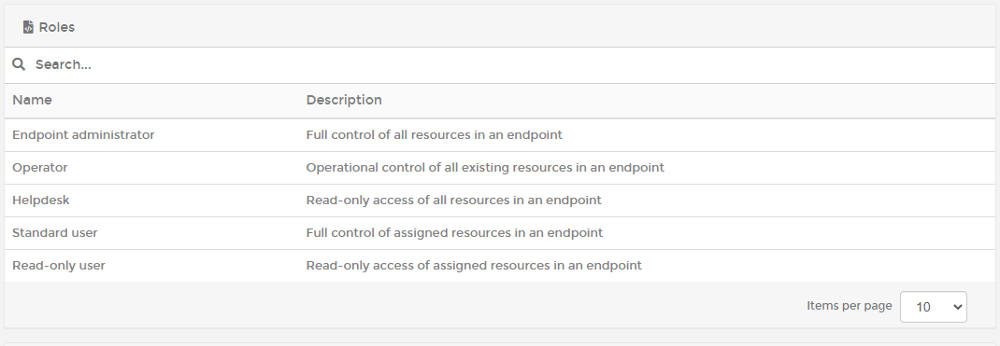
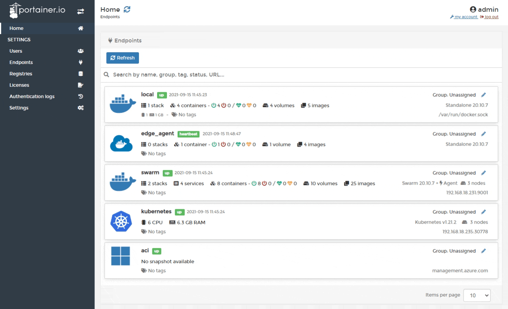

# Roles

Portainer Business Edition comes with Role-Based Access Control (RBAC) features that refine the access privileges available natively within Portainer. The RBAC feature allows you to create granular user access across all resources and all endpoints defined within Portainer.

## The basics

* A _role_ is a predefined set of privileges.
* _Privileges_ define the rights to perform actions.
* Users are assigned roles, and each role has specific privileges.
* To assign privileges, pair a user or team with a role then associate that pairing with an endpoint or endpoint group.
* A single user or team can have different roles for different endpoints in the Portainer inventory.

## Built-in roles

There are several types of roles:

* **Endpoint administrator** has full access within a given endpoint, but cannot make any changes to the infrastructure that underpins an endpoint (i.e. no host management), nor are they able to make changes to Portainer internal settings. Endpoint administrators are also unable to change ownership of resources.
* **Operator** has operational control over the resources deployed within a given endpoint. Operator can update, re-deploy, start and stop containers/services, check logs and console into containers, but cannot create any resources.
* **Helpdesk** has read-only access to the resources deployed within a given endpoint but cannot make changes to any resource, nor can they open a console to a container or make changes to a container’s volumes.
* **Standard User** has complete control over the resources that a user deploys, or if the user is a member of a team, has complete control over the resources that users of that team deploy.
* **Read-Only User** has read-only access to the resources they are entitled to see (resources created by members of their team, and public resources).

The **Administrator** role sits outside of the other roles and effectively acts as a 'Global Admin'. A user assigned to this role has complete control over Portainer settings, and all resources on every endpoint under Portainer's control.

## Viewing user access

Portainer's **Effective access viewer** lets you see what access a user has. From the menu select **Users** then select **Roles**.

Select a user from the **User** dropdown. The user's roles and their access on your endpoints will display. Select **Manage access** on any row to be taken to the [endpoint's access configuration](../endpoints/access.md).

## Docker vs Kubernetes

Because Docker does not natively provide role-based access control, we implement our own role management in order to provide this functionality. On a Kubernetes environment, we leverage the RBAC functionality built into Kubernetes alongside our own role management to provide security and flexibility to roles and access.

For more information about how we map Portainer roles to Kubernetes roles, see our [roles and bindings documentation](../../advanced/kubernetes-roles-and-bindings.md).
