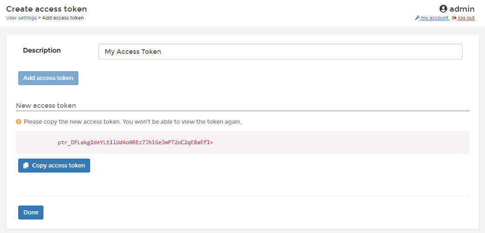

# Accessing the Portainer API

To access the Portainer API, you will need a few things:

* A user in Portainer
* An access token for that user
* The ability to make HTTPS requests to the Portainer server on port `9443` (or `9000` for legacy HTTP)

## Creating a new user

API access is provided on a per-user basis, with each users' API access dependent on that user's permissions within Portainer. For example, if your user had access to only one environment, API calls for that user would also be restricted to that environment.

To create a new user within Portainer, refer to our documentation:


[add.md](../admin/users/add.md)


Once the user has been created, log in to Portainer as that user to create an API access token.

## Creating an access token

Once the user has been created, you can add an access token to that user. The access token will provide the same level of access to Portainer functionality as would be available to that user had they logged into the Portainer UI.

Once logged in as the user, click on **my account** in the top right.


Scroll down to the **Access tokens** section. Here you can see any access tokens that exist for the user.&#x20;


To add a new access token, click the **Add access token** button. You will be taken to a new page where you can set a Description for your access token. We recommend making this something recognizable for future reference.&#x20;


Once you have provided a description, click the **Add access token** button to generate your access token.

Your new access token will now be displayed. Please copy the access token and keep it in a safe place, as you will not be able to view the token again after creation.



When you have copied the access token, click the **Done** button to return to the User settings page. Your access token is ready to use.

## Using your access token

Now that you have created a user and access token, you are ready to access the API. The Portainer API follows the RESTful architecture, accepting `GET` / `POST` / `PUT` / `DELETE` requests and responding with JSON objects.


The following examples use [httpie](https://httpie.org/) to execute API calls against Portainer. Feel free to replace this with your method of choice.


To make an API request, you will need to include your access token in the `X-API-Key` header to authenticate your request. For example, you can use the `/stacks` endpoint to list the stacks you have access to:

```
http GET https://portainer-url:9443/api/stacks X-API-Key:your_api_key_here
```

This will return a JSON object listing your stacks:

```
[
    {
        "AdditionalFiles": null,
        "AutoUpdate": null,
        "CreatedBy": "admin",
        "CreationDate": 1631852794,
        "EndpointId": 4,
        "EntryPoint": "docker-compose.yml",
        "Env": null,
        "GitConfig": {
            "Authentication": null,
            "ConfigFilePath": "docker-compose.yml",
            "ConfigHash": "2e71920bf1ee1bbac976d320f8f274411fba3bad",
            "ReferenceName": "refs/heads/master",
            "URL": "https://github.com/mygithubaccount/wordpress-stack"
        },
        "Id": 5,
        "IsComposeFormat": true,
        "Name": "",
        "Namespace": "my-namespace",
        "ProjectPath": "/data/compose/5",
        "ResourceControl": null,
        "Status": 1,
        "SwarmId": "",
        "Type": 3,
        "UpdateDate": 0,
        "UpdatedBy": ""
    },
]
```

If a user tries to access an area they do not have permission to access, an error message will be returned. For example, assume that a non-administrator user attempted to access the `/settings` endpoint, which requires administrator access:

```
http GET https://portainer:9443/api/settings X-API-Key:your_api_key_here
```

The user would be presented with the following response:

```
{
    "details": "Unauthorized",
    "message": "Access denied"
}
```

Now that you have access to the Portainer API, you can learn more about how to use it from the [API documentation](docs.md) and our [usage examples](examples.md).
