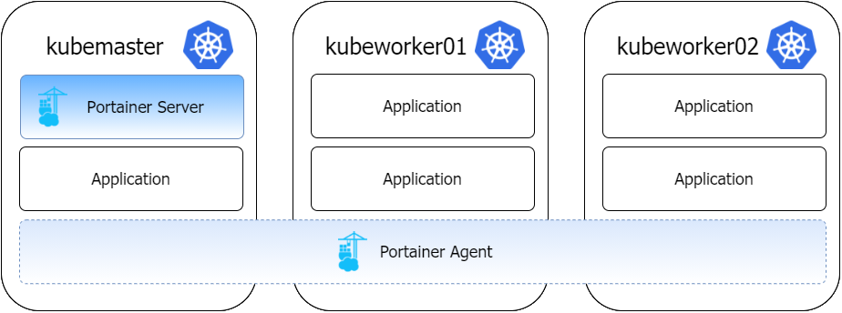
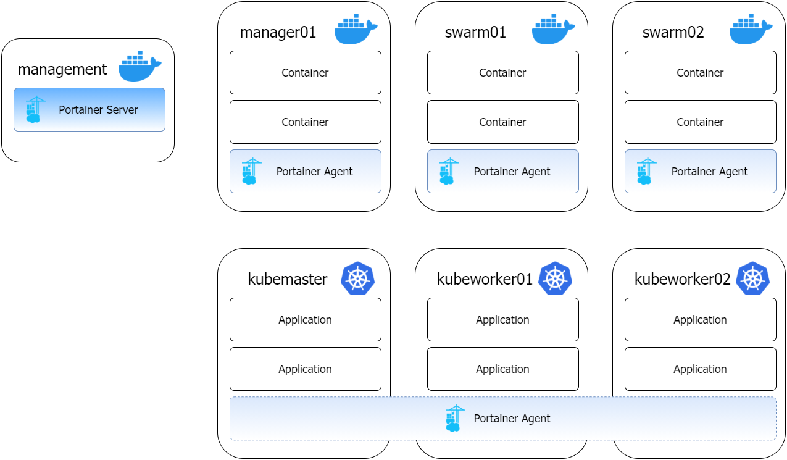

# What is a "node" for licensing purposes?

With Portainer Business Edition, pricing is on a "per-node" basis. But what constitutes a node?

## Docker

For Docker, we consider anything that runs Portainer, whether that be Portainer Server or Portainer Agent, as a node. This is important to remember as on clustered environments like Docker Swarm the Portainer Agent will be running on each server in the cluster and therefore count towards your number of licenses.


If you are managing a Swarm cluster without using the Portainer Agent, those nodes will still count toward the number of licensed nodes. If it runs Docker-CE, is a Kubelet, or is a serverless endpoint and you manage it with Portainer, it counts as a node.


Let's look at a few examples. Say you are running a small setup consisting of three Docker Standalone servers. One of these servers is hosting the Portainer Server container, and the other two are managed from the Portainer Server container using the Portainer Agent:

In this scenario, Portainer is running in three places (one Server and two Agents) so would need a 3 node license. 

Now, for Docker Swarm let's imagine a setup with one manager node (`manager01`) and two worker nodes (`swarm01` and `swarm02`):

.png>)

Portainer Server is running on the manager node, and the agent is runs on all three nodes across the swarm. Therefore, this would also require a 3 node license.


If a node is running both the Portainer Server and the Portainer Agent, this is only counted as one node for licensing purposes.


## Kubernetes

Kubernetes by nature works differently to Docker, so licensing does too. Let's consider a Kubernetes cluster with one master node and two worker nodes:

With Kubernetes, the Portainer Agent has the ability to access the Kubernetes API in order to manage the entire cluster. This access is used to determine the number of nodes in the cluster (three in this case) which then gives you the required number of licenses (three).

## Multiple environments

But what if you're running multiple environments? Let's combine what we have above into something more complex: one "management" server (running Docker Standalone) that manages a three node Docker Swarm and a three node Kubernetes cluster:

You'll note the Portainer Server is only running in one place - the management server. The rest of the cluster is running the Portainer Agent. With three Docker Swarm nodes and three nodes in the Kubernetes cluster that's 6 nodes, plus the management node makes 7, for a 7 node license.

Hopefully that has made the node licensing model easier to understand. If you're still confused, feel free to [reach out to our success team](mailto:success@portainer.io) who can help put a quote together for your specific needs.
