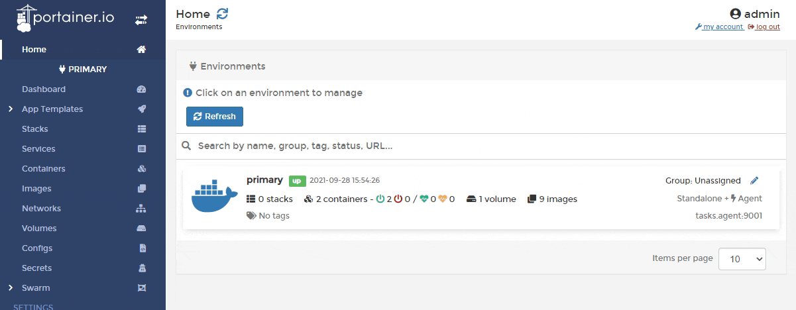
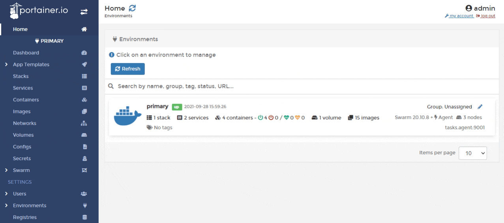

# Installing

## How do I install Portainer?

Portainer installation depends on a number of things. This includes the installation environment (Docker Standalone, Docker Swarm, Kubernetes) and the platform that the environment runs on (Linux, Windows, Serverless).

New to Portainer? Our [getting started guide](../start/intro.md) will walk you through the installation process. For our more experienced users, we recommend reading the guide or taking a look at our more comprehensive [installation instructions](../start/install/).

## Can I run Portainer on my configuration?

While we would love to say yes, there are just too many variables to consider when guaranteeing support for every possible configuration.

When releasing new versions of Portainer, we perform extensive testing on the most common configurations (see our [list of validated configurations](../start/requirements-and-prerequisites.md#validated-configurations) for each version). Portainer may function perfectly on configurations that are not listed, but because we have not tested them, we cannot promise that they will be compatible.

## How do I change the port that Portainer uses?

By default, Portainer runs on port `9443`. To change the port, edit the `-p` parameter of your `docker run` command to suit. For example, if you wanted Portainer to listen on port 443:

```
-p 443:9443
```

## My host is using SELinux. Can I use Portainer?

If you want to manage a local Docker environment with SELinux enabled, you’ll need to pass the `--privileged` flag to the Docker run command when deploying Portainer:



```
docker run -d --privileged -p 9443:9443 -p 8000:8000 --name portainer --restart always -v /var/run/docker.sock:/var/run/docker.sock -v portainer_data:/data portainer/portainer-ee:latestdocker run -d --privileged -p 9443:9443 -p 8000:8000 --name portainer --restart always -v /var/run/docker.sock:/var/run/docker.sock -v portainer_data:/data portainer/portainer-ee:latest
```



```
docker run -d --privileged -p 9443:9443 -p 8000:8000 --name portainer --restart always -v /var/run/docker.sock:/var/run/docker.sock -v portainer_data:/data portainer/portainer-ce:latest
```



You can also take a look at this [helper](https://github.com/dpw/selinux-dockersock).

## Does Portainer support WSL1?

Portainer requires WSL2 to run and does not support WSL1.

## Which ARM architectures does Portainer support?

We build our ARM images to support the ARM64 architecture primarily (as indicated in our [requirements and prerequisites](../start/requirements-and-prerequisites.md)), with ARMv7 support also available. We do not provide or support builds below ARMv7 (such as ARMv6) for Portainer.

As architectures evolve and the world moves more toward 64-bit as the default, there is less and less support for 32-bit architectures available. In the case of Portainer, some of the binaries we embed are no longer available for ARMv6 and below, preventing us from being able to provide a fully functioning Portainer environment on these older systems.

## Portainer isn't starting on my Windows server -help!

When running Portainer Server or the Portainer Agent on a Windows server, you may be presented with an error similar to the following:

```
failure in a Windows system call: The system cannot find the file specified.
```

In some instances we have seen antimalware software (in particular, Trend Micro Deep Security) silently removing the Portainer and Agent executables from container images when they are pulled. As a result, when the container attempts to start it is missing the executable it needs, and returns the above error.

In this instance, you can restore the removed executables to the image from within your antimalware software (for Trend Micro Deep Security, [this documentation may help](https://help.deepsecurity.trendmicro.com/20\_0/on-premise/anti-malware-restore-files.html)). We would also advise adding exceptions for `portainer.exe` and `agent.exe` in your antimalware configuration to prevent this in the future.

## How can I ensure Portainer's configuration is retained?

### Docker Standalone

The commands in our [installation guide](../start/install/server/docker/) include the creation of a `portainer_data` volume for Portainer to store data, and using this will ensure that the configuration remains even when the Portainer container is restarted, upgraded or removed.

### Docker Swarm

Our [recommended deployment](../start/install/server/swarm/) stack file constrains Portainer to a manager node, which will work well if you have a single manager node. If you have multiple managers however this will potentially become a problem. Each stack or service update action could move the Portainer container between manager nodes, and you may see Portainer appear as a fresh install.

One solution is to constrain your Portainer container to the node where your Portainer data is being persisted. To do this, you will first need to find the hostname of the node where the Portainer volume is being persisted. Within Portainer, from the menu select **Volumes** and note down the value in the **Host** column for your Portainer volume (usually called `portainer_portainer_data`). In the below example, this is `ce-manager01`.



Next, from the menu select **Services** then the `portainer_portainer` service, then click **Placement constraints**.



Click the **placement constraint** button to add a new constraint. Enter `node.hostname` for the **Name** and the hostname you gathered previously for the **Value**.


Finally, click **Apply changes** to apply your constraint.

### Kubernetes

For Kubernetes environments we recommend using a default StorageClass with cluster-available storage to avoid issues. Alternatively you can use a nodeSelector with your deployment to restrict the Portainer instance to a chosen node. This method is described in more detail in our [Kubernetes installation guide](../start/install/server/kubernetes/baremetal.md#data-persistence).

## How do I enter my Portainer Business license into Portainer CE?

Due to the differences between Portainer features and versions, we don't provide a way to enter a Portainer Business license directly into Portainer CE. Instead, [switch images from CE to BE](../start/upgrade/tobe/) then enter your trial license to get all the functionality of BE. You should experience no data loss when switching the images over.
