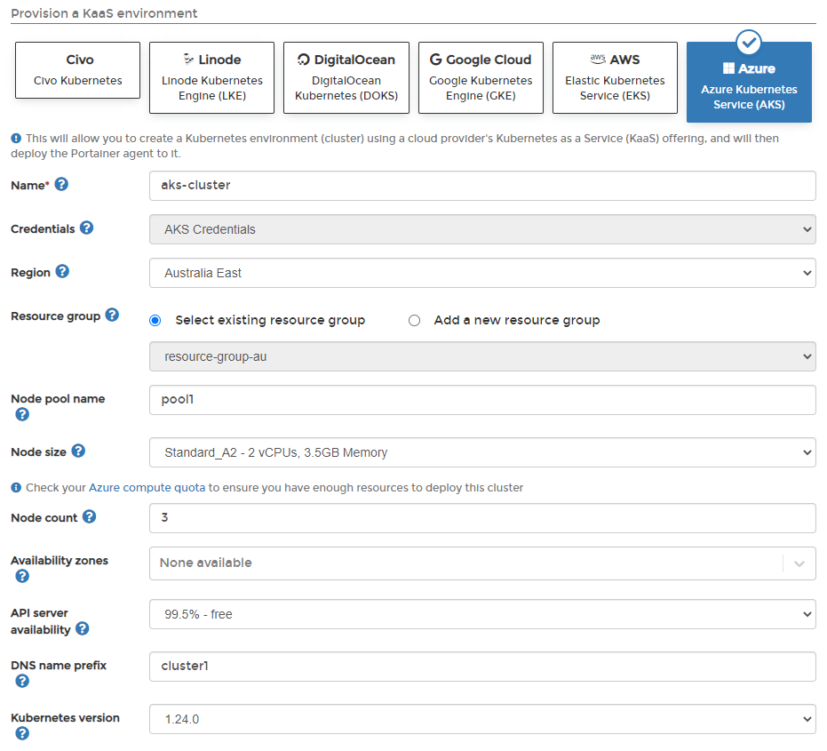

# Azure

Select the **Azure** option from the list of providers. If you haven't already configured credentials for Azure you'll be asked to provide them now. Enter a **name** for your credentials then enter your **Subscription ID**, **Tenant ID**, **Client ID** and **Client Secret**. Once this is done, click **Save**.


You can find more details on [setting up access to your Azure account](../../../../admin/settings/cloud/aks.md) in the [cloud credentials documentation](../../../../admin/settings/cloud/).


Once you have added your credentials (or if you already had them set up) select your cluster options from the fields below.

| Field/Option            | Overview                                                                                                                                                    |
| ----------------------- | ----------------------------------------------------------------------------------------------------------------------------------------------------------- |
| Name                    | Enter a name for your cluster.                                                                                                                              |
| Credentials             | Select the set of credentials to use for the provision.                                                                                                     |
| Region                  | Select the region to deploy your cluster in.                                                                                                                |
| Resource group          | Select an existing resource group or add a new resource group for your cluster.                                                                             |
| Node pool name          | Enter a name for your node pool.                                                                                                                            |
| Node size               | Select the size of the individual nodes in your cluster.                                                                                                    |
| Node count              | Enter the number of nodes to provision in your cluster.                                                                                                     |
| Availability zones      | Select the availability zones to use for your cluster.                                                                                                      |
| API server availability | Select the uptime SLA you require for your cluster.                                                                                                         |
| DNS name prefix         | Enter the DNS name prefix to use with your cluster. You will use this to connect to the Kubernetes API when managing containers after creating the cluster. |
| Kubernetes version      | Select the version of Kubernetes you want to deploy on your cluster                                                                                         |


The environment options are refreshed automatically if the information cached by Portainer is over 12 hours old. You can manually refresh the options by clicking **Reload cluster details** under the **Actions** section.


You can also expand the **More settings** section and set groups and tags for your environment now or you can do this later.

Once you have made your selections, click **Provision environment** to begin the provision. If you have other environments to configure click **Next** to proceed, otherwise click **Close** to return to the list of environments where you will see the progress of your provision.
