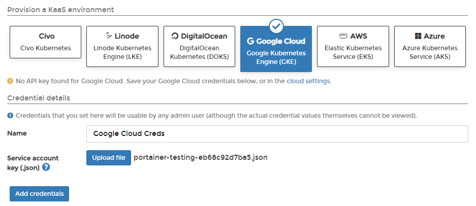
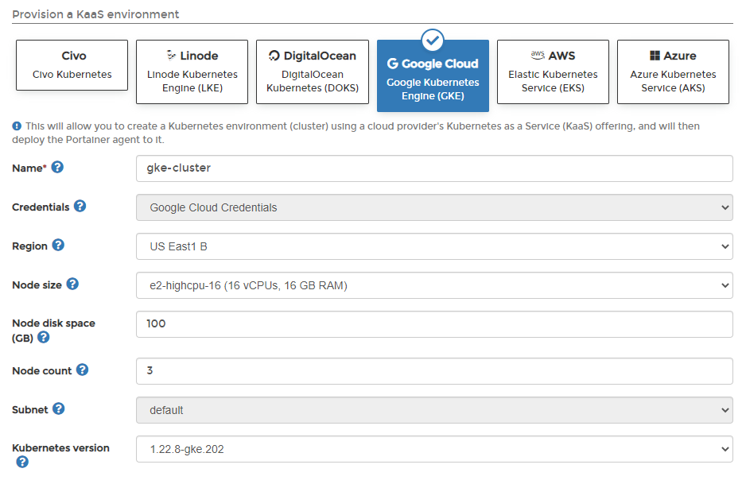

# Google Cloud

Select the **Google Cloud** option from the list of providers. If you haven't already configured credentials for Google Cloud you'll be asked to provide them now. Enter a **name** for your credentials then click **Upload file** and select your JSON private key. Once this is done, click **Save**.


You can find more details on [setting up access to your Google Cloud account ](../../../../admin/settings/cloud/gke.md)in the [cloud credentials documentation](../../../../admin/settings/cloud/).


Once you have added your credentials (or if you already had them set up) select your cluster options from the fields below.

| Field/Option         | Overview                                                            |
| -------------------- | ------------------------------------------------------------------- |
| Name                 | Enter a name for your cluster.                                      |
| Credentials          | Select the set of credentials to use for the provision.             |
| Region               | Select the region to deploy your cluster in.                        |
| Node size            | Select the size of the individual nodes in your cluster.            |
| Node disk space (GB) | Enter the amount of disk space to provision on each node.           |
| Node count           | Enter the number of nodes to provision in your cluster.             |
| Subnet               | Select the subnet to attach to the cluster.                         |
| Kubernetes version   | Select the version of Kubernetes you want to deploy on your cluster |


The environment options are refreshed automatically if the information cached by Portainer is over 12 hours old. You can manually refresh the options by clicking **Reload cluster details** under the **Actions** section.


You can also expand the **More settings** section and set groups and tags for your environment now or you can do this later.

Once you have made your selections, click **Provision environment** to begin the provision. If you have other environments to configure click **Next** to proceed, otherwise click **Close** to return to the list of environments where you will see the progress of your provision.
