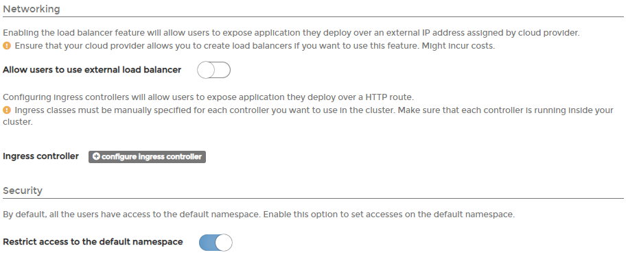
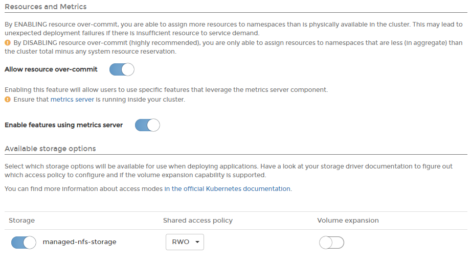

# Install Portainer Agent with Kubernetes on your Self-Managed Infrastructure


These instructions are for Portainer Community Edition. For Business Edition, please refer to the Business Edition documentation.


## Introduction

Portainer consists of two elements, the _Portainer Server_ and the _Portainer Agent_. Both elements run as lightweight containers on Kubernetes. This document will outline how to install the Portainer Agent on your cluster and how to connect to it from your Portainer Server instance. If you do not have a working Portainer Server instance yet, please refer to the [Portainer Server installation guide](../../server/kubernetes/baremetal.md) first.

To get started, you will need:

* A working and up to date Kubernetes cluster.
* Access to run `kubectl` commands on your cluster.
* Cluster Admin rights on your Kubernetes cluster. This is so Portainer can create the necessary `ServiceAccount` and `ClusterRoleBinding` for it to access the Kubernetes cluster.

The installation instructions also make the following assumption about your environment:

* You will be using the `portainer` namespace for Portainer.

## Deployment

To deploy Portainer Agent within a Kubernetes cluster you can use our provided YAML manifests.


Helm charts for agent-only deployments will be available soon.


### Method 1: Deploying using NodePort

From the menu select **Endpoints** then click **Add endpoint**. Ensure **Agent** is selected in **Environment type**.


In the **Information** section select the correct operating system for the new endpoint then select the **Kubernetes via node port** tab. Copy the command, then run it on the control node of your Kubernetes cluster. 


Make sure you run this command on your Kubernetes node before continuing.



The deployment command will return something similar to this:

```text
namespace/portainer created
serviceaccount/portainer-sa-clusteradmin created
clusterrolebinding.rbac.authorization.k8s.io/portainer-crb-clusteradmin created
service/portainer-agent created
service/portainer-agent-headless created
deployment.apps/portainer-agent created
```

To validate that the agent is running, use this command:

```text
 kubectl get pods --namespace=portainer
```

The result should look something like this:

```text
NAME                               READY   STATUS    RESTARTS   AGE
portainer-agent-5988b5d966-bvm9m   1/1     Running   0          15m
```

### Method 2: Deploying using Load Balancer

From the menu select **Endpoints** then click **Add endpoint**. Ensure **Agent** is selected in **Environment type**.


In the **Information** section select the correct operating system for the new endpoint then select the **Kubernetes via load balancer** tab. Copy the command, then run it on the control node of your Kubernetes cluster. 


Make sure you run this command on your Kubernetes node before continuing.



The deployment command will return something similar to this:

```text
serviceaccount/portainer-sa-clusteradmin created
clusterrolebinding.rbac.authorization.k8s.io/portainer-crb-clusteradmin created
service/portainer-agent created
service/portainer-agent-headless created
deployment.apps/portainer-agent created
```

To validate that the agent is running, use this command:

```text
 kubectl get pods --namespace=portainer
```

The result should look something like this:

```text
NAME                               READY   STATUS    RESTARTS   AGE
svclb-portainer-agent-52xrp        1/1     Running   0          2m26s
```

## Completing the configuration

Regardless of the method used, once the agent is running on the Kubernetes host, you must complete the appropriate environmental details.

| Field/Option | Overview |
| :--- | :--- |
| Name | Give the endpoint a descriptive name. This is a required field. |
| Endpoint URL | Define the IP address or name used to connect to the endpoint \(the Kubernetes host\) and specify the port if required \(`30778` when using NodePort; `9001` when using Load Balancer\). This is a required field. |
| Public IP | Enter the URL or IP address where exposed containers will be reachable. This field is optional and will default to the endpoint URL. |


In the **Metadata** section, as an optional step you can categorize the endpoint by adding it to a [group](../../../../admin/endpoints/groups.md) or  [tagging](../../../../admin/endpoints/tags.md) it for better searchability.


When you're ready, click **Add endpoint**. You will then be taken to the Kubernetes features configuration where you can set the following options:

| Field/Option | Overview |
| :--- | :--- |
| Allow users to use external load balancer | If enabled, users can expose an application deployed over an external IP address assigned by a cloud provider. |
| Ingress controller | Adding ingress controllers lets users expose an application deployed over an HTTP route. |
| Restrict access to the default namespace | This feature lets you restrict access to the default name space to specific users or groups. |



<table>
  <thead>
    <tr>
      <th style="text-align:left">Field/Option</th>
      <th style="text-align:left">Overview</th>
    </tr>
  </thead>
  <tbody>
    <tr>
      <td style="text-align:left">Allow resource over-commit</td>
      <td style="text-align:left">This allows you to toggle the over-commit feature, letting you assign
        more resources to namespaces than are physically available within your
        cluster.</td>
    </tr>
    <tr>
      <td style="text-align:left">Enable features using metrics server</td>
      <td style="text-align:left">If enabled, users can use specific features that leverage the metrics
        server component. The metrics server must be installed on your Kubernetes
        cluster to use this.</td>
    </tr>
    <tr>
      <td style="text-align:left">Available storage options</td>
      <td style="text-align:left">
        <p>Select which options will be available to users when they deploy applications.
          First, take a look at your storage driver documentation to figure out which
          access policy to configure, and if volume expansion capability is supported.
          Options are:</p>
        <p></p>
        <ul>
          <li><b>Local-path:</b> Applications will be stored in the node.</li>
          <li><b>Shared Access Policy:</b> RWO or RWX.</li>
          <li><b>Volume Expansion:</b> Enable to expand the persistent storage of the
            pods.</li>
        </ul>
      </td>
    </tr>
  </tbody>
</table>




Find more information about access modes in [Kubernetes' own documentation](https://kubernetes.io/docs/concepts/storage/persistent-volumes/#access-modes).


When the setup is complete, click **Save configuration**. 

