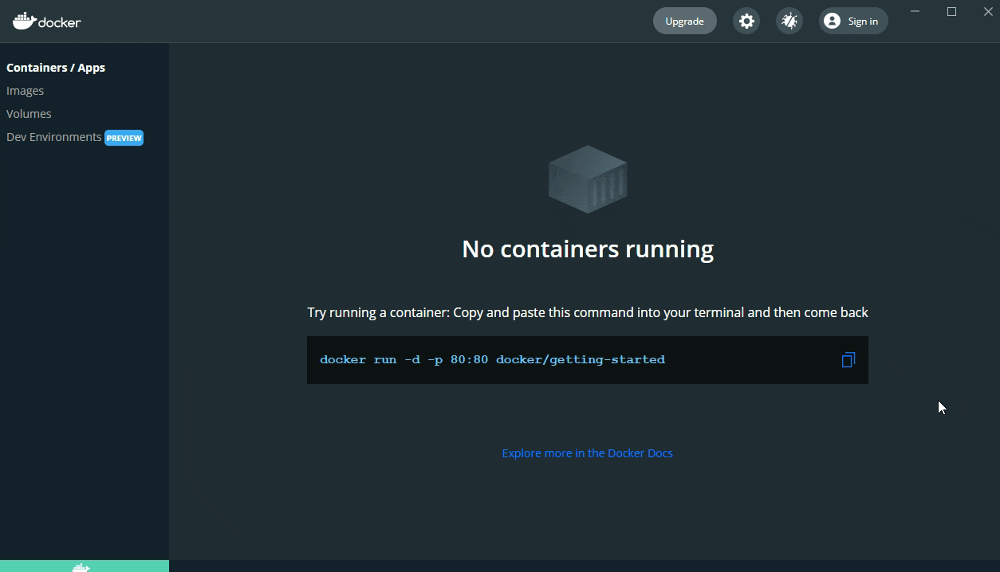

# Install Portainer with Kubernetes on WSL / Docker Desktop

## Introduction

The following instructions will guide you in setting up _Portainer Server_ with Kubernetes running on Docker Desktop with WSL.


This scenario is for testing purposes only.


## Preparation

Before you start, you must make sure that Kubernetes is enabled and running within your Docker Desktop installation. To enable Kubernetes in Docker Desktop, you need to open the dashboard of Docker Desktop. Right click the Docker icon in the system tray and click **Dashboard**:


Click **Settings**, then select **Kubernetes**, tick **Enable Kubernetes**, then click **Apply and Restart** \(clicking **Install** in the dialog to install Kubernetes\):



After a few minutes, you will see that Kubernetes is running in the bottom left status bar of Docker Desktop:


## Deployment

Based on how you would like expose the Portainer Service, select an option below:



Using the following command, Portainer will be available on port `30777`.

```text
kubectl apply -n portainer -f https://raw.githubusercontent.com/portainer/k8s/master/deploy/manifests/portainer/portainer-ee.yaml
```



Using the following command, Portainer will be available at an assigned Load Balancer IP at port `9000`.

```text
kubectl apply -n portainer -f https://raw.githubusercontent.com/portainer/k8s/master/deploy/manifests/portainer/portainer-lb-ee.yaml
```



## Logging In

Now that the installation is complete, you can log into your Portainer Server instance. Depending on how you chose to expose your Portainer installation, open a web browser and navigate to the following URL:



```bash
http://localhost:30777/
```



```bash
http://localhost:9000/
```



Replace `localhost` with the relevant IP address or FQDN if needed, and adjust the port if you changed it earlier.

You will be presented with the initial setup page for Portainer Server.



