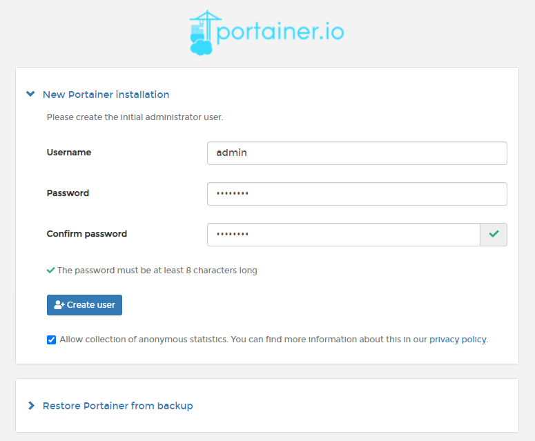
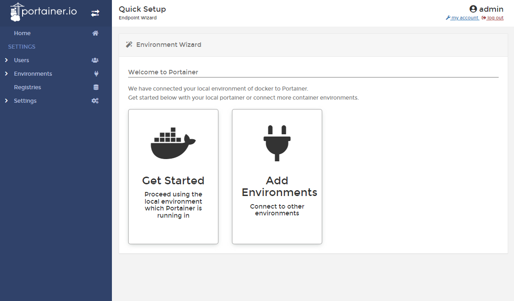

# Initial setup

Once the Portainer Server has been deployed, and you have navigated to the instance's URL, you are ready for the initial setup.


These instructions are for Portainer Community Edition (CE). For Portainer Business Edition (BE), read the [BE documentation](https://docs.portainer.io/v/be-2.7/).


## Creating the first user

Your first user will be an administrator. The username defaults to `admin` but you can change it if you prefer. The password must be at least eight characters long.

## Enabling or disabling the collection of statistics

We use a tool called [Matomo](https://matomo.org) to collect anonymous information about how Portainer is used. We recommend leaving this option enabled so we can make improvements based on usage. For more about what we do with the information we collect, read our [privacy policy](https://www.portainer.io/privacy-policy).

During installation, you can enable or disable connection statistics using the checkbox. If you change your mind later, you can easily update this option under [Settings](../../../admin/settings/) in the Portainer UI.

## Connecting Portainer to your environments

Once the admin user has been created, the **Environment Wizard** will automatically launch. The wizard will help get you started with Portainer.

The installation process automatically detects your local environment and sets it up for you. If you want to add additional environments to manage with this Portainer instance, click **Add Environments**. Otherwise, click **Get Started** to start using Portainer!
