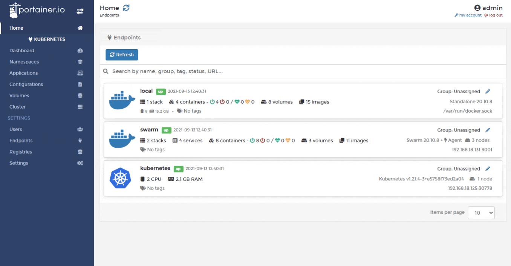

# Upgrading on Kubernetes


Always match the agent version to the Portainer Server version. In other words, when you're installing or upgrading to Portainer 2.10.0 make sure all of the agents are also on version 2.10.0.



Starting from Portainer BE 2.10, HTTPS is enabled by default on port `9443.` These instructions will configure Portainer to use both `9443` for HTTPS and `9000` for HTTP. You can choose to [completely disable HTTP](../../admin/settings/#force-https-only) after the upgrade.&#x20;

Before you make Portainer HTTPS only, make sure you have all your Agents and Edge Agents already communicating with Portainer using HTTPS.&#x20;


Select the Portainer upgrade method which matches the original installation method used.

## Method 1: Upgrading using Helm

Add the Portainer Helm repository by running the following commands. Ignore any warnings about the repo already being there:

```
helm repo add portainer https://portainer.github.io/k8s/
helm repo update
```

Next, run the following command to upgrade to the latest version of Portainer:

```
helm upgrade -n portainer portainer portainer/portainer
```

## Method 2: Upgrading using YAML Manifest

### Option 1: Via the Portainer UI

The easiest way to upgrade is to use the Portainer UI along with our manifest files. Copy the contents of the manifest file that matches the method you used to deploy Portainer:



Copy the contents of our NodePort manifest file at:

```
https://raw.githubusercontent.com/portainer/k8s/master/deploy/manifests/portainer/portainer-ee.yaml
```

For an agent-only deployment, use the following manifest instead:

```
https://downloads.portainer.io/portainer-agent-k8s-nodeport.yaml
```


If you have set a custom `AGENT_SECRET` on your Portainer Server instance you must remember to explicitly provide this in the YAML when updating your agent:

`environment:`

&#x20; `- AGENT_SECRET: yoursecret`




Copy the contents of our Load Balancer manifest file at:

```
https://raw.githubusercontent.com/portainer/k8s/master/deploy/manifests/portainer/portainer-lb-ee.yaml
```

For an agent-only deployment, use the following manifest:

```
https://downloads.portainer.io/portainer-agent-k8s-lb.yaml
```


If you have set a custom `AGENT_SECRET` on your Portainer Server instance you must remember to explicitly provide this in the YAML when updating your agent:

`environment:`

&#x20; `- AGENT_SECRET: yoursecret`




Log into Portainer and connect to the Kubernetes environment where Portainer is installed. From the menu select **Applications** then select **Advanced Deployment**. Select the `portainer` namespace then select **Web Editor**:



Paste the contents of the YAML file then click **Deploy**. Portainer will process the manifest and should return you to the login page once the upgrade is complete.

### Option 2: Via the command line

If you prefer to use the command line to upgrade, you can do so using `kubectl` commands:



Log into the control node of your Kubernetes cluster and run the following command:

```
kubectl apply -n portainer -f https://raw.githubusercontent.com/portainer/k8s/master/deploy/manifests/portainer/portainer-ee.yaml
```

For an agent-only deployment, use the following command instead:

```
kubectl apply -n portainer -f https://downloads.portainer.io/portainer-agent-k8s-nodeport.yaml
```


If you have set a custom `AGENT_SECRET` on your Portainer Server instance you must remember to explicitly provide this in the YAML when updating your agent:

`environment:`

&#x20; `- AGENT_SECRET: yoursecret`




Log into the control node of your Kubernetes cluster and run the following:

```
kubectl apply -n portainer -f https://raw.githubusercontent.com/portainer/k8s/master/deploy/manifests/portainer/portainer-lb-ee.yaml
```

For an agent-only deployment, use the following command:

```
kubectl apply -n portainer -f https://downloads.portainer.io/portainer-agent-k8s-lb.yaml
```


If you have set a custom `AGENT_SECRET` on your Portainer Server instance you must remember to explicitly provide this in the YAML when updating your agent:

`environment:`

&#x20; `- AGENT_SECRET: yoursecret`




When the deployment is finished you will be able to log into Portainer. You should notice the new version number at the bottom-left of the Portainer UI.

## Method 3: Force an update

If Portainer does not update after running the above commands, you can force a download of the latest image by running the following command:

```
kubectl -n portainer rollout restart deployment.apps/portainer
```

Or, for an agent-only deployment, use this command instead:

```
kubectl -n portainer rollout restart deployment.apps/portainer-agent
```
