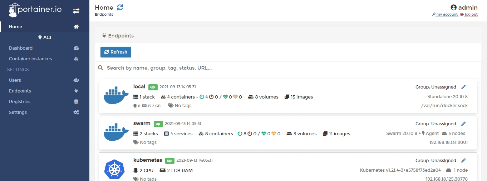
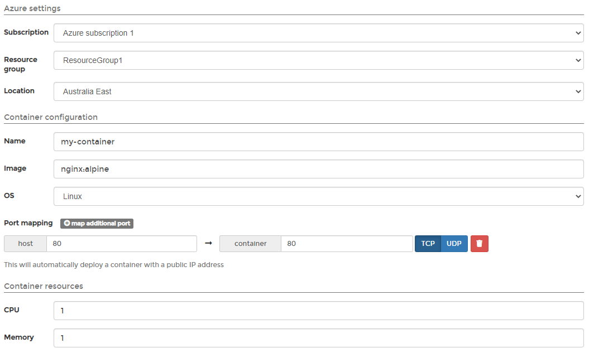

# Add a new container

From the menu select **Container instances** then click **Add container**.

Complete the configuration, using the table below as a guide:

| Field/Option | Overview |
| :--- | :--- |
| Subscription | Select the subscription you want to use for the container. |
| Resource group | If two or more resource groups exist, select where you want to deploy the container. |
| Location | Select which datacenter to run the container in. |
| Name | Give the container a descriptive name. |
| Image | Enter the name of the image that will be used to deploy the container. |
| OS | Select the OS \(typically Linux or Windows\). |
| Port mapping | Select the port needed to publish to the Internet. |
| CPU | Define how much CPU to allocate to the container. |
| Memory | Define how much memory to allocate to the container. |

When you're ready, click **Deploy the container**. When the deployment has finished, you'll see it in the list of  Azure container instances.

