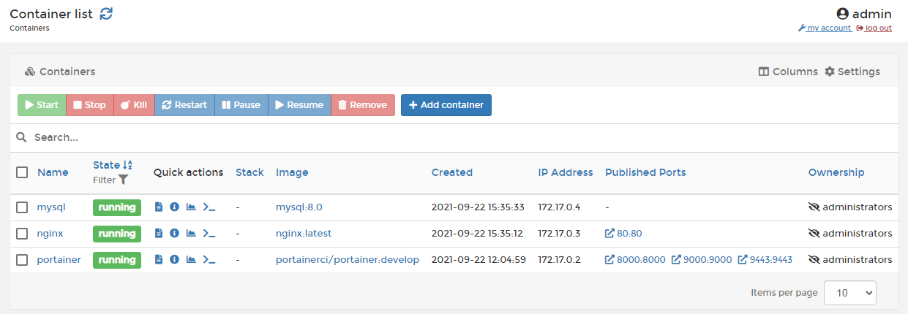

# Containers

Put simply, a container is a runnable instance of an image. Containers do not hold any persistent data and therefore can be destroyed and recreated as needed.


[add.md](add.md)


Once a container has been created you can inspect it, edit or duplicate it, attach volumes, view logs and statistics, edit ownership, and access its console.


[view.md](view.md)



[inspect.md](inspect.md)



[edit.md](edit.md)



[attach-volume.md](attach-volume.md)



[logs.md](logs.md)



[ownership.md](ownership.md)



[stats.md](stats.md)



[console.md](console.md)


If you no longer need a container, you can remove it.


[remove.md](remove.md)


