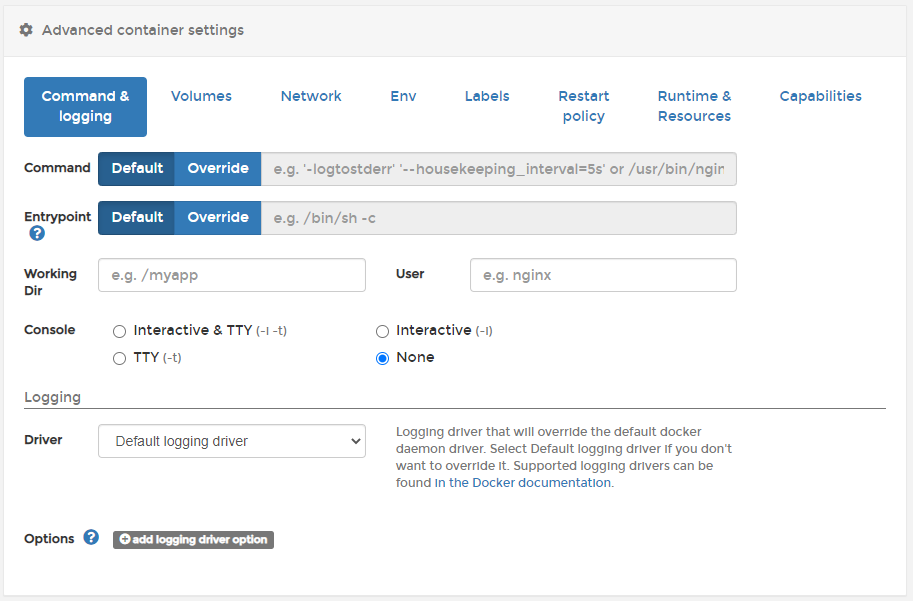

# Add a new container

Select **Containers** from the menu then click **Add Container**.

Configure the container settings as required.

## Image configuration

| Field/Option          | Overview                                                                                                                                   |
| --------------------- | ------------------------------------------------------------------------------------------------------------------------------------------ |
| Name                  | Give the container a descriptive name.                                                                                                     |
| Registry              | Select the registry that has the image you wish to use for your container.                                                                 |
| Image                 | Enter the name of the image you wish to use.                                                                                               |
| Always pull the image | Toggle on to enforce pulling the image from the registry instead of using the locally cached copy (if you have used the image previously). |


When using Docker Hub you can use the **Search** button to search for the image you have entered, and ensure that you have the correct name and tag. Portainer also displays the number of pulls remaining for your Docker Hub account when using an anonymous account.


Alternatively you can switch to advanced mode to manually enter registry and image details. This is useful if you want to do a one-off container deployment from a registry that isn't configured within Portainer.

## Actions

| Field/Option | Overview                                                                                                                            |
| ------------ | ----------------------------------------------------------------------------------------------------------------------------------- |
| Auto remove  | Toggle this option on to automatically remove the container once it exits. This is useful if you want to run a container only once. |

## Network ports configuration

| Field/Option                                           | Overview                                                                                                 |
| ------------------------------------------------------ | -------------------------------------------------------------------------------------------------------- |
| Publish all exposed network ports to random host ports | Toggle on to allow Portainer to randomly assign ports on the host to the exposed ports in the container. |
| Manual network port publishing                         | Click **publish a new network port** to create manual port mappings for the container.                   |

Once complete, set any advanced options (see below) and click **Deploy the container. **If successful your container will be shown in the container list.

## Advanced container settings

Choose from a range of options to customize the deployment.

