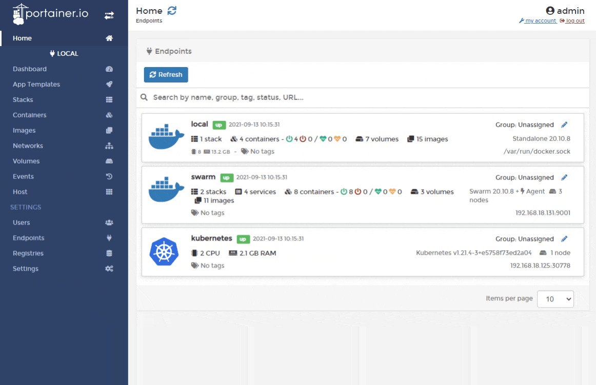
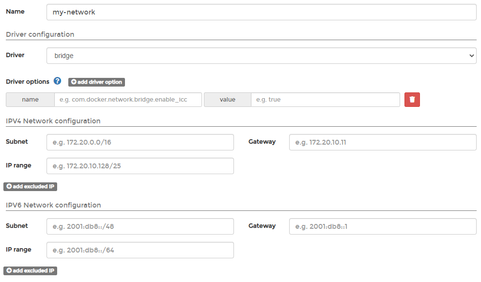

# Add a new network

From the menu select **Networks** then click **Add network**.

Define the new network, using the table below as a guide.

| Field/Option | Overview |
| :--- | :--- |
| Name | Give the network a descriptive name. |
| Driver | Define the [type of network](add.md#supported-network-types) you will use. |
| Driver options | Set in place any options related to your network driver, if required. |
| IPv4 Network configuration | Define IPv4 range, subnet, gateway and exclude IP. If no information is entered here, Docker will automatically assign an IPv4 range. |
| IPv6 Network configuration | Define IPv6 range, subnet, gateway and exclude IP. If no information is entered here, Docker will automatically assign an IPv6 range. |
| Labels | Add labels to the network. |
| Isolated network | Toggle this option on to isolate any containers created in this network to this network only, with no inbound or outbound connectivity. |
| Enable manual container attachment | Toggle this option on to allow users to attach the network to running containers. |
| Deployment | On multi-node clusters, select the node where the network will be created. |

When you're finished, click **Create the network**.

