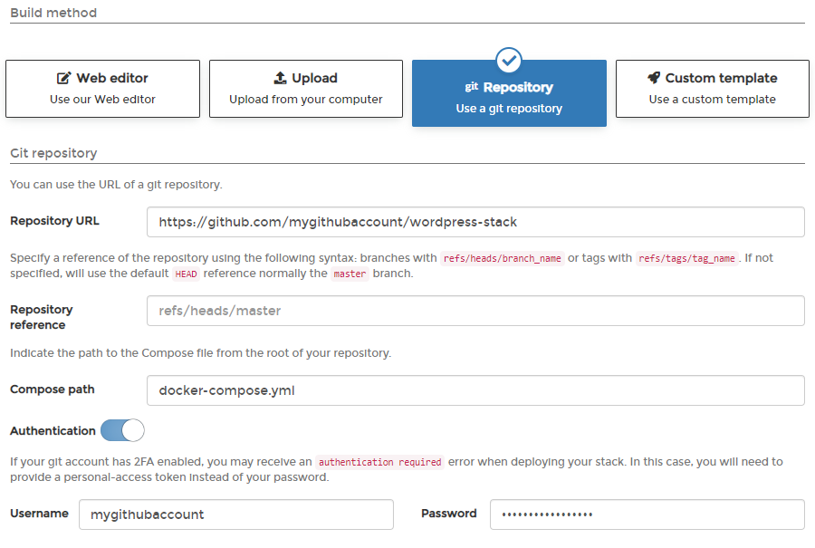

# Add a new stack

## Options when deploying a new stack

There are four ways to deploy a new stack from Portainer:

| **Field/Option** | **Overview**                                                                                         |
| ---------------- | ---------------------------------------------------------------------------------------------------- |
| Web editor       | Use our web editor to define the services for the stack using a docker-compose format.               |
| Upload           | If you have a `stack.yml` file, you can upload it from your computer and use it to deploy the stack. |
| Git Repository   | You can use a docker-compose format file hosted in GitHub.                                           |
| Custom template  | If you have already created a template of stacks, you can deploy using this option.                  |

## Option 1: Web editor

From the menu select **Stacks**, click **Add stack**, give the stack a descriptive name then select **Web editor**. Use the web editor to define the services.

As an optional step, you can also use the web editor to define environment variables. You can use these to define values in your compose file that would vary between deployments (for example, hostnames, database names, etc).


Note the compose file is not changed when environment variables are used - this allows variables to be updated within Portainer without editing the compose file itself. You will still see the `${MY_ENVIRONMENT_VARIABLE}` style entry in the compose file.


When you're ready, click **Deploy the stack**.

## Option 2: Upload

In Portainer you can create stacks from Compose YML files. To do this, from the menu select **Stacks**, click **Add stack**, then give the stack a descriptive name.

Select **Upload** then select the Compose file from your computer. As an optional step, enter any environment variables. You can use these to define values in your compose file that would vary between deployments (for example, hostnames, database names, etc).


Note the compose file is not changed when environment variables are used - this allows variables to be updated within Portainer without editing the compose file itself which would take it out of sync with your local copy. You will still see the `${MY_ENVIRONMENT_VARIABLE}` style entry in the compose file.


When you're ready click **Deploy the stack**.

## Option 3: GitHub

If your Compose file is hosted in GitHub, you can deploy from there. From the menu select **Stacks**, click **Add stack**, then select **Git Repository**.


Any Git-compatible repository should work here. Substitute the details as required.


Give the stack a descriptive name then enter information about your Git repo:

| **Field/Option**     | **Overview**                                                  |
| -------------------- | ------------------------------------------------------------- |
| Repository URL       | The repository URL.                                           |
| Repository Reference | The branch.                                                   |
| Compose Path         | The path to the Compose file from the root of the repository. |

If you need to authenticate, enter the username and password.


If you have 2FA configured in GitHub, your passcode is your password.


As an optional step, you can also set environment variables. You can use these to define values in your compose file that would vary between deployments (for example, hostnames, database names, etc).


Note the compose file is not changed when environment variables are used - this allows variables to be updated within Portainer without editing the compose file itself which would take it out of sync with the Git repository. You will still see the `${MY_ENVIRONMENT_VARIABLE}` style entry in the compose file.


Enter environment variables if required then click **Deploy the stack**.
