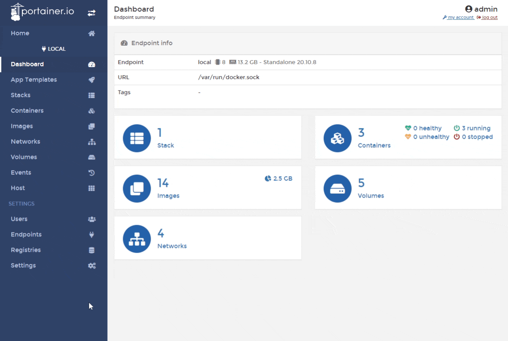
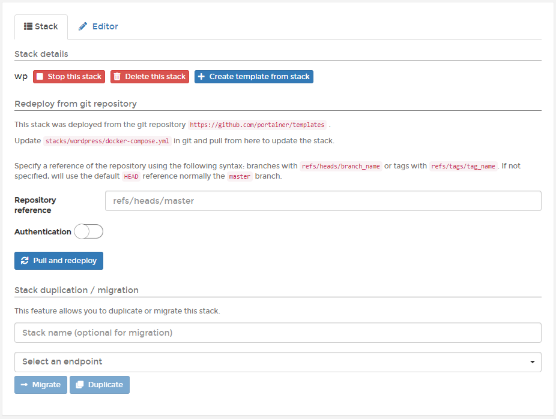
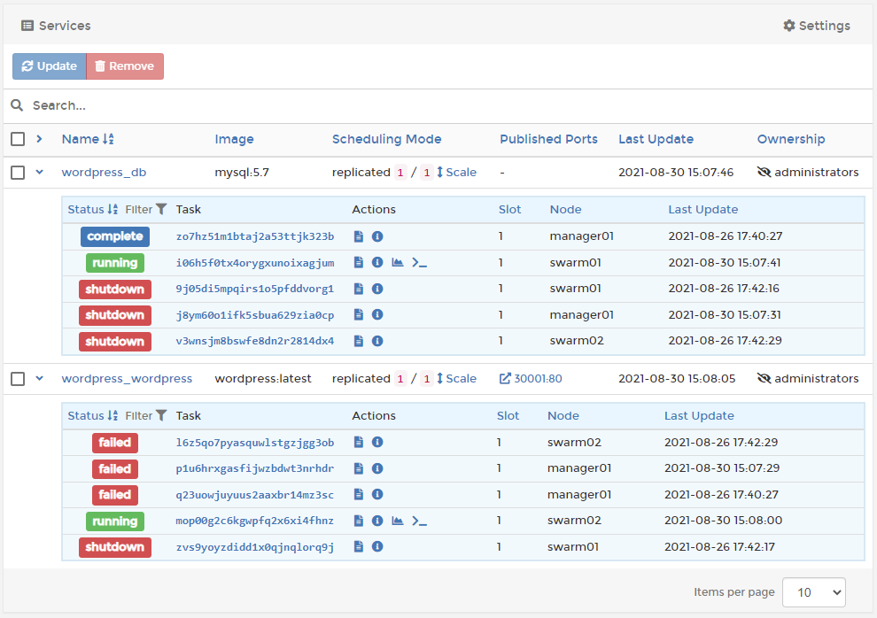
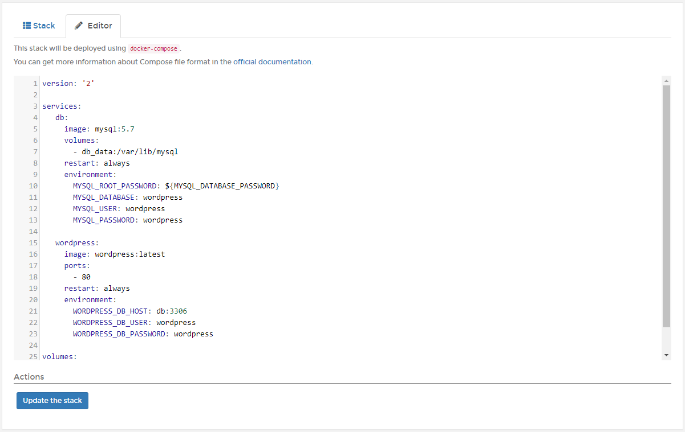

# Inspect or edit a stack

See what's running on a stack, or get access to logs and stats.

## Inspecting a stack

From the menu select **Stacks** then select the stack you want to inspect.

Here you can:

* Stop, delete or [create a template from the stack](template.md).
* Redeploy the stack from a Git repository.
* [Migrate or duplicate](migrate.md) the stack.

### Docker Standalone

When using Docker Standalone, you can:

* View the containers that make up the stack.
* Check to see if they are running or stopped.
* Get access to logs.
* Inspect individual containers.
* View container statistics.
* Get access to the container's console.

### Docker Swarm

When using Docker Swarm, you can:

* View the services that make up the stack.
* Check to see if they are running or stopped.
* See how many replicas are running on each host.
* Get access to logs.
* Inspect individual services.
* View service statistics.
* Get access to the service's console.

## Editing a stack

Editing a stack allows you to make changes to the configuration and redeploy those changes. To edit a stack, from the menu select **Stacks**, select the stack you want to edit, then select the **Editor** tab.

Here, you can edit the Compose file for the stack to suit your needs. With Docker Swarm, you can also make changes to environment variables for the stack, as well as prune services if you have made changes that remove some services from the stack.

When you have finished making changes, click **Update the stack**.

