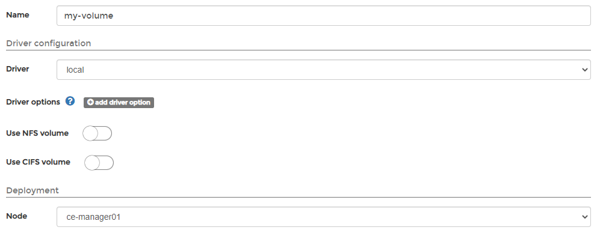
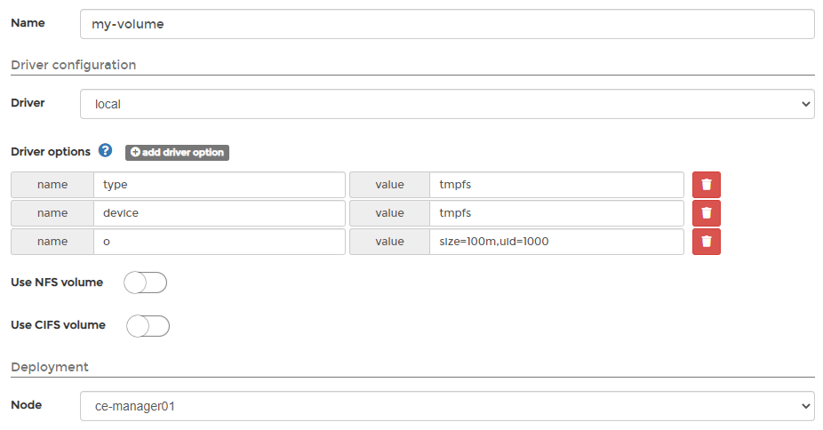

# Add a new volume

## Adding a local volume

From the menu select **Volumes** then click **Add volume**.

Complete the information in the **Create volume** screen, using the table below as a guide.

| Field/Option    | Overview                                                            |
| --------------- | ------------------------------------------------------------------- |
| Name            | Give the volume a descriptive name.                                 |
| Driver          | Select `local`.                                                     |
| Use NFS volume  | Toggle this off.                                                    |
| Use CIFS volume | Toggle this off.                                                    |
| Deployment      | On a multi-node cluster, define the node that will hold the volume. |

When you're finished, click **Create the volume**.

## Adding an NFS volume


In Portainer, you can mount an NFS volume to persist the data of your containers.


From the menu select **Volumes** then click **Add volume**.&#x20;

Complete the information in the **Create volume** screen, using the table below as a guide.

| Field/Option    | Overview                                                            |
| --------------- | ------------------------------------------------------------------- |
| Name            | Give the volume a descriptive name.                                 |
| Driver          | Select `local`.                                                     |
| Use NFS volume  | Toggle this on.                                                     |
| Use CIFS volume | Toggle this off.                                                    |
| Deployment      | On a multi-node cluster, define the node that will hold the volume. |

Under the **NFS Settings** section, complete the following.

| Field/Option | Overview                                                              |
| ------------ | --------------------------------------------------------------------- |
| Address      | Enter the hostname or IP address of your NFS server.                  |
| NFS Version  | Select the NFS version that your NFS server uses.                     |
| Mount point  | Enter the path where the volume is mounted, for example `/mnt/nfs01`. |
| Options      | Leave the default values.                                             |

When you're finished, click **Create the volume**.

## Adding a CIFS volume


In Portainer, you can mount a CIFS volume to persist the data of your containers.


From the menu select **Volumes** then click **Add volume**.

Complete the information in the **Create volume** screen, using the table below as a guide.

| Field/Option    | Overview                                                            |
| --------------- | ------------------------------------------------------------------- |
| Name            | Give the volume a descriptive name.                                 |
| Driver          | Select `local`.                                                     |
| Use NFS volume  | Toggle this off.                                                    |
| Use CIFS volume | Toggle this on.                                                     |
| Deployment      | On a multi-node cluster, define the node that will hold the volume. |

Under the **CIFS Settings** section, complete the following:

| Field/Option | Overview                                    |
| ------------ | ------------------------------------------- |
| Address      | Enter the CIFS server name or IP address.   |
| Share        | Enter the name of the share resource.       |
| CIFS Version | Select the CIFS version that you are using. |
| Username     | Enter the user to authenticate.             |
| Password     | Enter the password to authenticate.         |

When you're finished, click **Create the volume**.

## Adding a tmpfs volume

From the menu select **Volumes** then click **Add volume**.&#x20;

Complete the information in the **Create volume** screen, using the table below as a guide.

| Field/Option    | Overview                                                                                                                                                                                                                                                                          |
| --------------- | --------------------------------------------------------------------------------------------------------------------------------------------------------------------------------------------------------------------------------------------------------------------------------- |
| Name            | Give the volume a descriptive name.                                                                                                                                                                                                                                               |
| Driver          | Select `local`.                                                                                                                                                                                                                                                                   |
| Driver options  | Click **add driver option** then add the following name/value combinations:                                                                                                                                                                                                       |
|                 | <ul><li>
name: <code>type</code>

value: <code>tmpfs</code>
</li><li>
name: <code>device</code>

value: <code>tmpfs</code>
</li><li>name: <code>o</code></li><li>value: <code>size=100m,uid=1000</code> (customize these values to suit your needs)</li></ul> |
| Use NFS volume  | Toggle this off.                                                                                                                                                                                                                                                                  |
| Use CIFS volume | Toggle this off.                                                                                                                                                                                                                                                                  |
| Deployment      | On a multi-node cluster, define the node that will hold the volume.                                                                                                                                                                                                               |

When you're finished, click **Create the volume**. The volume can now be attached to a container in the same way as any other volume.

Once attached, you can confirm that the tmpfs volume has been mounted correctly within the container:

