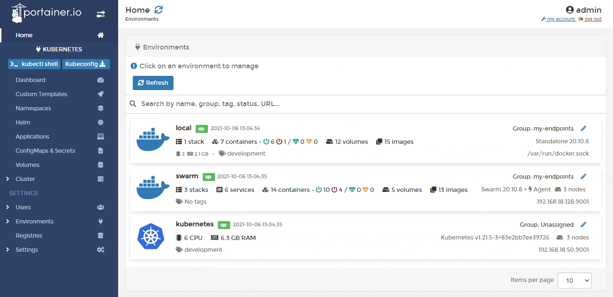
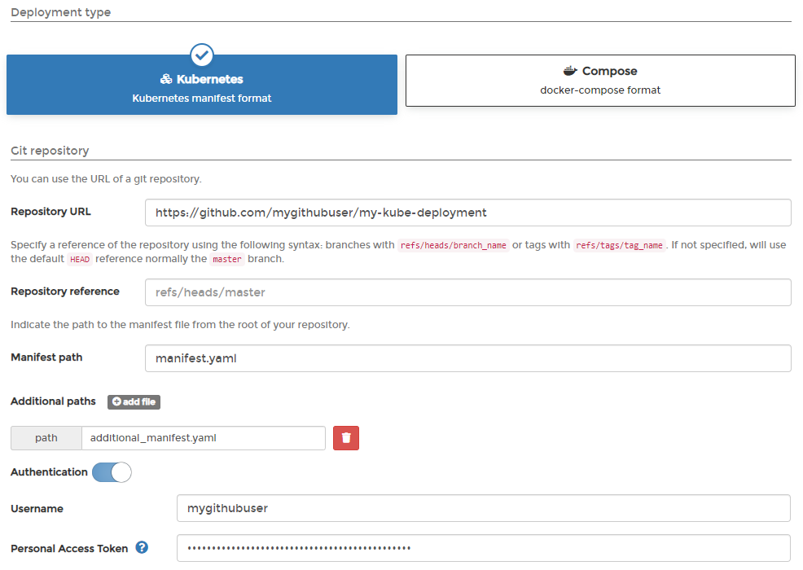

# Add a new application using a manifest

There are two ways to add a new application: [manually by using a form](add.md) or automatically by using a manifest. This article explains how to add an application using a manifest.


Manifests aren't just for applications - you can also deploy namespaces, ConfigMaps, secrets and volumes using a manifest.


From the menu select **Applications** then click **Create from manifest**.

Select the namespace for your deployment, define a name for your application, and then choose the build method from the options provided.

## Option 1: Git Repository

From **Deployment type** select either **Kubernetes** or **Compose** (depending on the format of the manifest) then enter the details of your Git repo.


Portainer uses Kompose to convert a Compose manifest to a Kubernetes-compliant manifest. Be aware that currently not all Compose format options are supported by Kompose.


| Field/Option          | Overview                                                                                                                              |
| --------------------- | ------------------------------------------------------------------------------------------------------------------------------------- |
| Repository URL        | Enter the URL to your Git repository.                                                                                                 |
| Repository reference  | Enter the reference to use when pulling from your repository. If this is left blank, Portainer will use the default `HEAD` reference. |
| Manifest path         | When using the Kubernetes deployment type, enter the path to your manifest file relative to the root of your repository.              |
| Compose path          | When using the Compose deployment type, enter the path to your compose file relative to the root of your repository.                  |
| Additional paths      | Click **add file** to define additional manifests or compose files to process as part of the deployment.                              |
| Authentication        | Toggle this on if your repository requires authentication.                                                                            |
| Username              | When using authentication, enter the username for your Git repository.                                                                |
| Personal Access Token | When using authentication, enter the personal access token or password for your Git repository.                                       |

### Automatic updates

Enabling Automatic updates gives Portainer the ability to update your application automatically, either by polling the repository at a defined interval for changes or by using a webhook to trigger an update.


For more detail on how automatic updates function under the hood, have a look at [this FAQ entry](../../../faq/troubleshooting/how-do-automatic-updates-for-stacks-applications-work.md).



If your application is configured for automatic updates and you make changes locally, these changes will be overridden by the application definition in the Git repository. Bear this in mind when making configuration changes.


| Field/Option   | Overview                                                                                                                            |
| -------------- | ----------------------------------------------------------------------------------------------------------------------------------- |
| Mechanism      | Choose from **Polling** or **Webhook**.                                                                                             |
| Fetch interval | When using the **Polling** method, choose how often you wish to check the Git repository for updates to your application.           |
| Webhook        | When using the **Webhook** method, this displays the webhook URL to use. Click **Copy link** to copy the webhook to your clipboard. |

| Field/Option       | Overview                                                                                                                                                                                                                                                                                                                                                                                                                                                                                                                                                                                   |
| ------------------ | ------------------------------------------------------------------------------------------------------------------------------------------------------------------------------------------------------------------------------------------------------------------------------------------------------------------------------------------------------------------------------------------------------------------------------------------------------------------------------------------------------------------------------------------------------------------------------------------ |
| Force Redeployment | 
Enable this setting to force the redeployment of your application at the specified interval (or when the webhook is triggered), overwriting any changes that have been made in the local environment, even if there has been no update to the application in Git. This is useful if you want to ensure that your Git repository is the source of truth for your applications and are happy with the local application being replaced.

If this option is left disabled, automatic updates will only trigger if Portainer detects a change in the remote Git repository.
 |

When you're ready, click **Deploy**.

## Option 2: Web editor

From **Deployment type** select either **Kubernetes** or **Compose** (depending on the format of the manifest) then write or paste in your Kubernetes manifest.&#x20;


Portainer uses Kompose to convert a Compose manifest to a Kubernetes-compliant manifest. Be aware that currently not all Compose format options are supported by Kompose.


When you're ready, click **Deploy**. &#x20;

## Option 3: URL

From **Deployment type** select either **Kubernetes** or **Compose** (depending on the format of the manifest) then enter the **URL** to your manifest file.


Portainer uses Kompose to convert a Compose manifest to a Kubernetes-compliant manifest. Be aware that currently not all Compose format options are supported by Kompose.


When you're ready, click **Deploy**.

## Option 4: Custom template

From the **Template** dropdown, select the custom template to use. As an optional step, you can edit the template before deploying the application. If you have no custom templates you will be given a link to the [Custom Templates](../templates/) section.

When you're ready, click **Deploy**.
