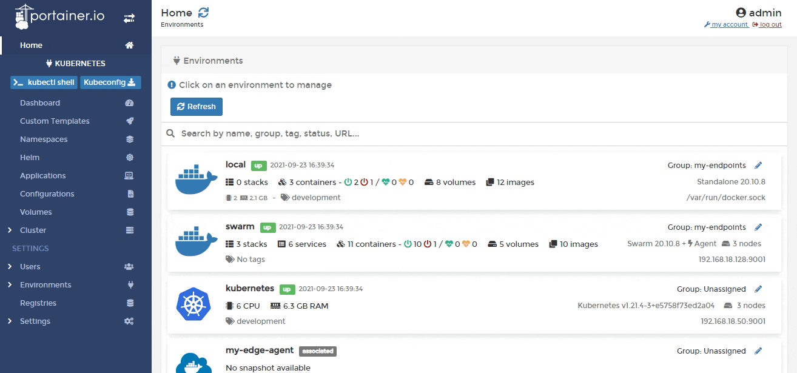

# Setup

You can make changes to your endpoint's Kubernetes configuration by selecting **Cluster** from the menu then selecting **Setup**.

## Networking

### Allow users to use external load balancer


To use this feature, you need to ensure that your cloud provider allows you to create load balancers. Using this feature may incur costs from your cloud provider.


Enabling the load balancer feature will allow users to expose applications they deploy over an external IP address assigned by their cloud provider.

### Ingress controller


Ingress classes must be manually specified for each controller you want to use in the cluster. Make sure that each controller is running inside your cluster.


Configuring ingress controllers will allow users to expose applications they deploy over a HTTP route.

## Security

### Restrict access to the default namespace

By default, a Kubernetes cluster will instantiate a default namespace when provisioning the cluster to hold the default set of pods, services, and deployments used by the cluster. If this option is enabled, the only users with the power to run applications in the default namespace are Portainer administrators.

## Resources and Metrics

### Allow resource over-commit


This option is only available in [Portainer Business Edition](https://www.portainer.io/business-upsell?from=k8s-setup-default).


Enabling this feature lets you allocate more resources to namespaces than are physically available in the cluster.


&#x20;**Enable** resource over-commit if you need to assign more resources to namespaces than are physically available in the cluster. This may lead to unexpected deployment failures if there are insufficient resources to meet the demand.

**Disable** resource over-commit (highly recommended) if you are only able to assign resources to namespaces that are less (in aggregate) than the cluster total, minus any system-resource reservation.


### Enable features using metrics server


&#x20;Ensure that the Kubernetes [metrics server](https://kubernetes.io/docs/tasks/debug-application-cluster/resource-metrics-pipeline/#metrics-server) is running inside your cluster.


Enabling this feature will allow users to use specific features that leverage the metrics server component.

## Available storage options

Select which storage options will be available for use when deploying applications. Take a look at your storage driver documentation to figure out which access policy to configure, and whether or not the volume-expansion capability is supported.

